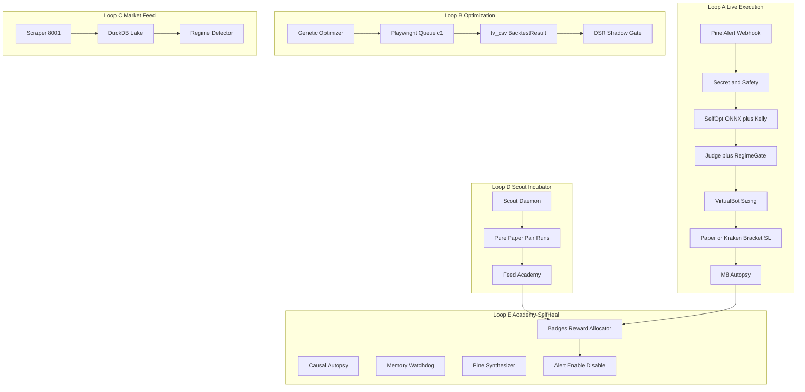
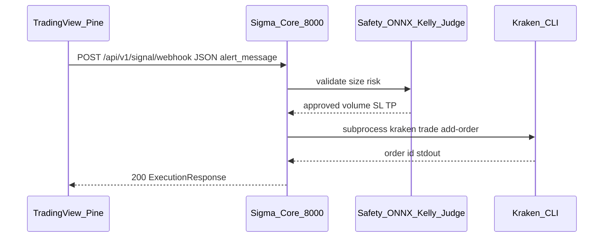
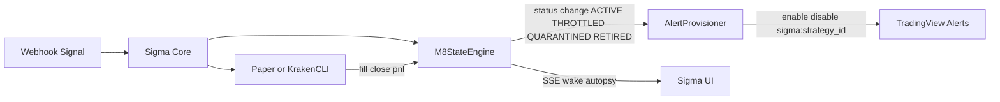
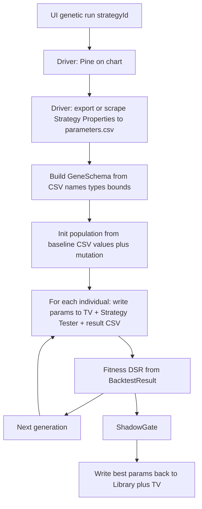
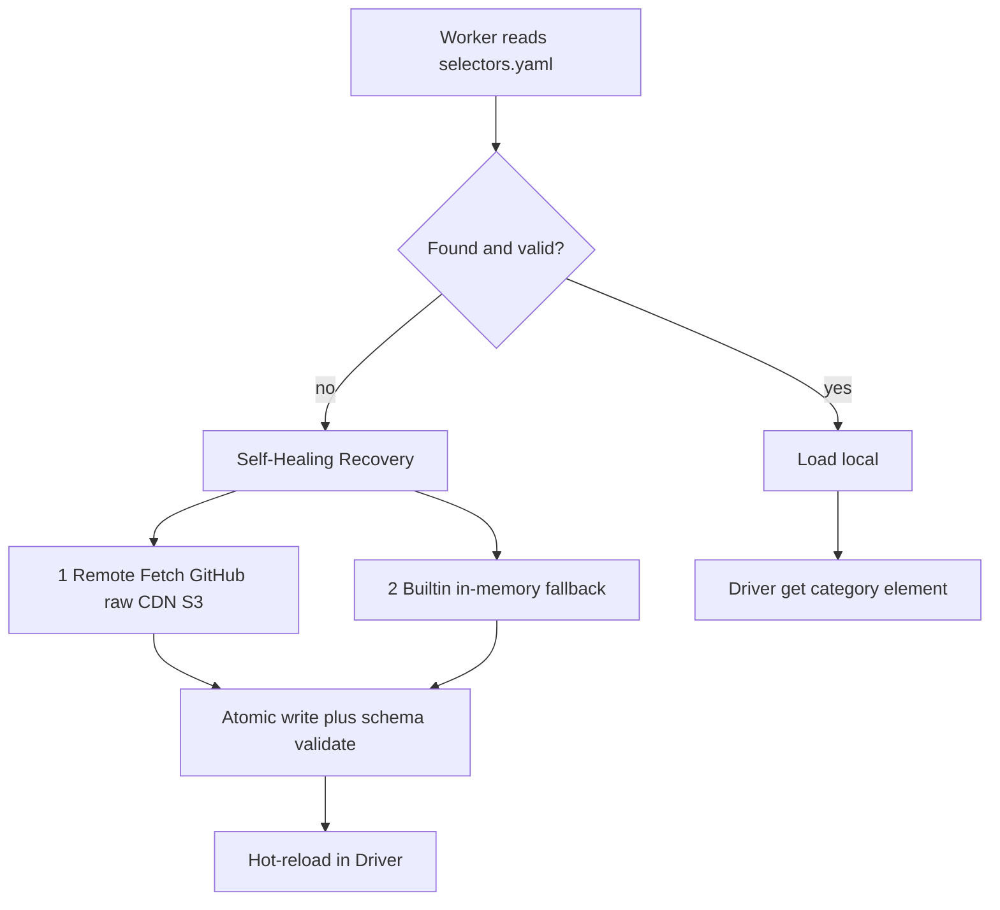
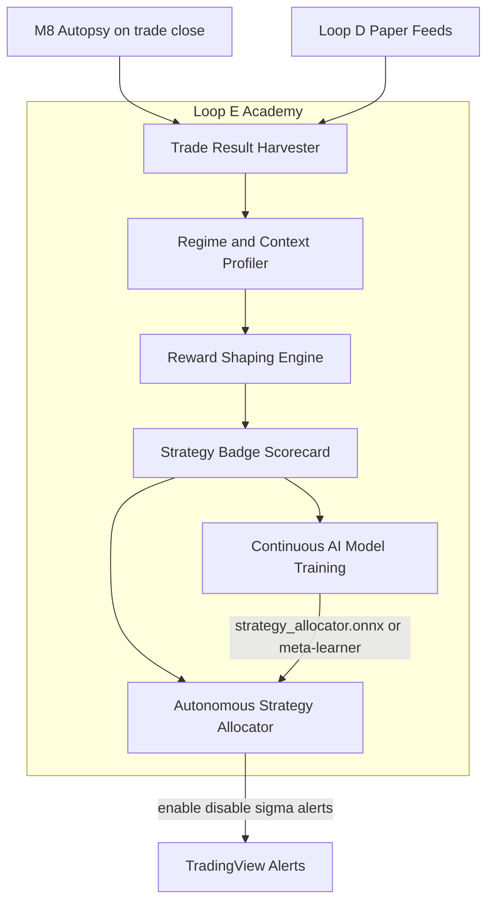

# Projekt:Sigma — Vollständige System-Blaupause (L4)

> **Status:** Canonical Spec Freeze v3.6 (Netron ONNX Graph Inspector) — `docs/BLUEPRINT-SIGMA.md`  
> **Masterprompt (KI-Persona):** [`docs/MASTERPROMPT.md`](MASTERPROMPT.md) — Ciel Core Matrix 3.0  
> **Lineage:** Fork von Alpha M8 Blueprint v1.2.0 / Skeleton v1.6.4  
> **Repo:** https://github.com/Finnlayy/Sigma  
> **Quelle Alpha:** `Finnlayy/Alpha` / lokaler Tree `project-alpha`

Dieses Dokument ist die verbindliche Blaupause. Der Masterprompt ist die Persona-/Axiom-Schicht für KI-Engines.

---

## 0. Was Sigma ist (und nicht ist)

**Ist:** Ubuntu-natives Level-4 Quant-/Execution-Framework — umgangssprachlich **„Privates Pionex auf Steroiden“**: Pionex-Style Bot-Karten mit festem Budget, angetrieben von TradingView Pine v6, ausgeführt BaFin-tauglich über **Kraken CLI**.

**Jede Strategie ist eine TradingView-/Pine-Strategie** — Einstellungen, Backtest, Alerts, Runner-Leben hängen an TV und werden von Sigma UI + Playwright darüber gesteuert. Risk/Execution (Virtual Bots, M8, Kelly, Kraken CLI) bleibt lokal, ist aber **kein** Ersatz für die Strategiesource.

**Ist nicht:** Alpha-Archetyp-Interpreter (`sma_cross` / `rsi_reversion`) als Primärstrategie. Lokale BacktestEngine als Strategy-Wahrheit. Yahoo-MCP als „TV Strategy“. Manuelles TV-Klicken als Betriebsvoraussetzung. Windows-TS-Portal. Pionex-Live-Futures in DE (nur optionales Lab/`spot_only`).

### 0.0 Produktvision

| Dimension | Sigma |
|-----------|-------|
| Usability | Strategie wählen → Budget zuweisen → Start; isolierter Bot-PnL |
| Power | Beliebige Pine v6; TV Strategy Tester + GA; Scout; Academy; Offline-LLM + Telegram |
| Engine | Kraken CLI Ubuntu; Ring-Fencing; native Bracket-SL + Deadman |

Strategy-Card Pflichtfelder: `RUNNING`/`PAUSED`/`QUARANTINED`, Kapital EUR, Bot-PnL, Max-Loss, **fester Hebel** (z. B. `5x`), XP/Strike.

### 0.1 Grundsatz: Strategy ≡ TradingView

Alles, was „Strategie“ heißt, bezieht sich auf TV und arbeitet darüber:

| Concern | Wo die Wahrheit liegt | Wie Sigma damit arbeitet |
|---------|----------------------|---------------------------|
| Strategie-Code | Pine v6 in TV (gespiegelt in `strategy.code`) | Monaco speichert → Playwright compile/add-to-chart |
| Strategie-Parameter | Pine `input.*` / Strategy Tester Properties | UI/GA schreibt Params → Playwright setzt TV-Inputs; Parameter-CSV Roundtrip |
| Backtest / Optimierung | TV Strategy Tester | Playwright Run + CSV → Sigma Fitness/UI (Nachschauen in TV erlaubt) |
| Live-Signale | TV Alerts + `alert_message` | Alert-Provisioner; Webhook → Core |
| Runner an/aus | TV Alert enable/disable + Sigma runner flag | UI Start/Stop steuert beides; M8 koppelt Quarantine |
| Chart / Symbol / TF | TV Chart Session | Driver/Provisioner setzt Symbol+Interval in TV |
| Risk nach dem Signal | Sigma M8 / Judge / Kelly / Kraken | **Nicht** die Strategiesource — nur Gate + Execution |

**Konsequenz:** Kein paralleler „lokaler Strategiemodus“. `StrategyInterpreter`-Archetypen entfallen als Live-Pfad. GA-Gene mappen auf **Pine-Inputs der TV-Strategie**, nicht auf interne SMA-Archetypen. Factory-Seeds in Sigma sind Pine-Templates, keine JS-Kommentar-Archetypen.

---

## 1. Prozesse, Ports, Verzeichnisse

| Prozess | Binary / Entry | Port | Arbeitsverzeichnis |
|---------|----------------|------|--------------------|
| **sigma-core** | `uvicorn app.server.main:app` | **8000** | `/opt/sigma` bzw. Repo-Root |
| **sigma-tv-scraper** | `uvicorn api.main:app` (vendored scraper) | **8001** | `vendor/tradingview-scraper` |
| **sigma-netron** | `python app/services/netron_server.py` | **8082** | Repo-Root |
| **sigma-tv-worker** | `python -m app.tv.worker` (Playwright Job-Consumer) | — | Repo-Root |
| **Redis** | redis-server AOF | **6379** | system |
| **UI (dev)** | `vite` | **3000** | Repo-Root |
| **Monaco surface** | Teil der Vite-App (Route `/orchestrator` bzw. StrategyEditor) | 3000 | — |

**Datenpfade (kanonisch):**

```
./data/
  secrets/tv_storage_state.json     # Playwright Login-State
  tv_exports/{job_id}/              # trades/performance/parameters CSVs
  tv_jobs/{job_id}.json             # Job-Persistenz
  signals/KILL_SWITCH               # L4 Soft-Kill (Datei existiert = hart block)
  signals/PAUSE
  logs/sigma_core.log
  logs/orders.jsonl
  logs/tv_worker.log
  duckdb/ … parquet/ …              # aus Alpha übernommen
```

**Installziel Ubuntu:** `/opt/sigma` (statt Alpha `/srv/alpha`), User `sigma`.

---

## 2. Architektur — fünf Loops (A–E)



| Loop | Trigger | Output | Autonomie |
|------|---------|--------|-----------|
| **A Live** | TV Alert HTTP POST | Order / Paper Fill + Autopsy | Vollautomatisch |
| **B Backtest/GA** | UI Run / GA | `BacktestResult` + ShadowGate | Vollautomatisch (Playwright) |
| **C Feed** | Poll / On-demand | OHLCV + Regime-Vektor | Vollautomatisch |
| **D Scout** | Cron / Queue | Paper-Trades → Academy | Vollautomatisch |
| **E Academy+Heal** | Trade Close / Cron | Badges, Reward, Allocator, Self-Heal, RAM | Vollautomatisch |

**Umbenennung:** Früheres „Loop D Academy“ (§18) ist jetzt **Loop E**. **Loop D = Scout & Incubator**.

---

## 3. Komponenten-Inventar (konkrete Module)

### 3.1 Behalten aus Alpha (Pfad → Rolle)

| Modul | Pfad | Sigma-Rolle |
|-------|------|-------------|
| M8 State | [`app/execution/M8StateEngine.py`](app/execution/M8StateEngine.py) | ACTIVE/THROTTLED/QUARANTINED/RETIRED; Redis `m8:state:{id}` |
| Judge | [`app/execution/JudgeEngine.py`](app/execution/JudgeEngine.py) | 8 Gates vor Order |
| Paper | [`app/execution/PaperExecutionEngine.py`](app/execution/PaperExecutionEngine.py) | Shadow bis LIVE_APPROVED |
| Vault | [`app/execution/VaultEngine.py`](app/execution/VaultEngine.py) | Profit Sweep |
| Autopsy | [`app/execution/AutopsyProcessor.py`](app/execution/AutopsyProcessor.py) | 5 Zonen |
| EOD PF | [`app/execution/EodProfitFactorEngine.py`](app/execution/EodProfitFactorEngine.py) | 3/7-Tage-Gates |
| Churn/Fee/Leverage | `app/execution/*` | Hygiene |
| Telemetry M-00 | [`app/core/telemetry.py`](app/core/telemetry.py) | SHADOW_ACTIVE / LIVE_APPROVED / EMERGENCY_HALT |
| DuckDB + Lake | `app/core/duckdb_store.py` | Persistenz |
| GeneticOptimizer | [`app/optimizer/GeneticOptimizer.py`](app/optimizer/GeneticOptimizer.py) | Orchestrierung behalten; **Eval ersetzen** |
| Academy | [`app/optimizer/AcademyRegistry.py`](app/optimizer/AcademyRegistry.py) | **Loop E:** Profiling/Badges (kein synthetischer Primär-Backtest) |
| React Command Center | [`src/`](src/) | Behalten, anpassen |
| Types | [`src/types.ts`](src/types.ts) | `BacktestResult`, `TradingStrategy`, Gene |
| Ubuntu stack Vorlage | [`stacks/ubuntu/`](stacks/ubuntu/) | Umbenennen alpha→sigma |
| CLI | [`bin/m8-ctl`](bin/m8-ctl) | Behalten / als `sigma-ctl` aliasen |

### 3.2 Neu bauen

| Modul | Pfad | Verantwortung |
|-------|------|----------------|
| Scraper-Client | `app/tv/scraper_client.py` | HTTP → `:8001` |
| Symbol/Interval Map | `app/tv/symbol_map.py`, `interval_map.py` | `BTC/USD`→`KRAKEN/BTCUSD`, `15`→`15m` |
| Strategy Tester Driver | `app/tv/strategy_tester_driver.py` | Playwright E2E |
| Selector Map | `app/tv/selectors.yaml` | DOM-Fallbacks (lokal + remote self-heal) |
| SelectorManager | `app/tv/selector_manager.py` | Self-Healing YAML: lokal → remote → builtin; atomic; hot-reload |
| Alert Provisioner | `app/tv/alert_provisioner.py` | TV Alert upsert/enable/disable; M8-gekoppelt |
| TV Worker | `app/tv/worker.py` | Redis/File-Queue Consumer |
| Login Bootstrap | `bin/sigma-tv-login` | Speichert `tv_storage_state.json` |
| CSV Seam | [`app/backtest/tv_csv.py`](app/backtest/tv_csv.py) (existiert) | Params/Trades/Perf → `BacktestResult` |
| Backtest Facade | [`app/backtest/TvMcpBacktest.py`](app/backtest/TvMcpBacktest.py) | Umbenennen sinnvoll → `TvBacktestService`; Queue+Cache |
| Quant Engine | `app/quant/onnx_kelly.py` | ONNX + Half-Kelly |
| Strategy Allocator | `app/optimizer/StrategyAllocator.py` | Badge+Regime → TV Alert an/aus (Loop E) |
| Virtual Bot Engine | `app/execution/VirtualBotEngine.py` | Budget-Ringfence, Sizing, Max-Loss, Profit Sweep |
| Regime Detector | `app/quant/regime_detector.py` | EMA-Delta, ATR-Perzentile, Hurst; Judge+Allocator |
| Self-Opt ONNX | `app/quant/self_optimizing_onnx.py` | Brier, Temperature, Hot-Reload |
| Reward Shaping | `app/optimizer/reward_shaping.py` | XP/Strike → M8 Multiplier / Quarantäne |
| Memory Watchdog | `app/core/memory_watchdog.py` | 4-Stufen RAM Guard; Idle-only |
| Deadman Switch | `app/execution/deadman_switch_daemon.py` | Heartbeat; Limit-Cancel |
| Telegram Operator | `app/services/telegram_bot_operator.py` | Bidirektional LLM + Fast-Path /kill |
| Scout Daemon | `app/scout/ScoutDaemon.py` | Loop D Paper Pairing |
| YAML Resolver | `app/tv/yaml_resolver.py` | Self-Heal selectors/param_bounds |
| Sigma Terminal | `src/components/SigmaTerminal.tsx` | FlexLayout 11-Panel Workspace |
| Webhook | Route in `app/server/main.py` | `POST /api/v1/signal/webhook` |
| Kraken Bridge | `app/execution/KrakenCliBridge.py` | `kraken trade add-order` Subprocess |
| Safety | `app/execution/SafetyGuard.py` | KILL_SWITCH / PAUSE / daily loss / consecutive errors |
| Config | `config/autonomy-level-4.yaml` + `app/core/config.py` `SigmaConfig` | `SIGMA_*` Env |

### 3.3 Streichen / ersetzen

| Artefakt | Aktion |
|----------|--------|
| `stacks/windows/**` | Weg (bereits) |
| `StrategyInterpreter` Live-Pfad | **Streichen** — Strategien nur noch über TV/Pine |
| Alpha Factory Archetyp-Seeds (`sma_cross` …) | Ersetzen durch **Pine-Templates** |
| `genes_to_params` → lokale Archetypen | Ersetzen durch `genes_to_pine_inputs` (TV Properties) |
| `BacktestEngine.run_backtest` in Prod | Nur Tests/Fake; Prod → TV Strategy Tester Jobs |
| `KrakenMCPBridge` 149 Mock-Tools als „Exchange“ | Durch `KrakenCliBridge` ersetzen |
| `ALPHA_*` Env | → `SIGMA_*` |
| Yahoo MCP als Primär-Backtest / Strategie | **Kein** Primärknoten |
| Firebase als Core-Dependency | Optional/ignorieren |

---

## 4. Loop A — Live Execution (Detail)

### 4.0 Was „Webhook-Pipeline“ meint (und was nicht)

| Begriff | Bedeutung in Sigma |
|---------|-------------------|
| **Webhook** | **Signaleingang** von TradingView: Pine `alert()` / `alert_message` → HTTP `POST` an Sigma Core |
| **Kraken CLI** | **Ausführung** der Order *danach* im Core (`kraken trade add-order`) — nicht der Webhook selbst |
| **Pionex / andere Börsen** | **Nicht** Teil dieses Sigma-Freeze. Kein Pionex-Webhook-Pfad. Andere Exchanges nur später als zusätzliche Bridges |

Ablauf in einem Satz: **TradingView schickt das Signal per Webhook → Sigma prüft/sized → Kraken CLI führt aus.**



Der Webhook ersetzt die Kraken-CLI **nicht**. Die CLI bleibt der Executor. Der Webhook ersetzt den früheren „internen Archetyp-Signalgenerator / Windows-Portal“, als Weg wie **Live-Signale von TV in den Core kommen**.

Paper-Modus: gleicher Webhook; Executor = native **Kraken CLI Paper** (`kraken futures paper order`) via `KrakenCliBridge` — siehe §32. Scout Loop D ist paper-only; Live erst nach Graduation oder Operator-Freigabe.

### 4.1 Webhook Alert Payload (kanonisch)

**Vollständige Schemata:** §33 (`SigmaL4AlertPayload`, Pionex, Pine-Emitter, `SignalExecutionResponse`).

Kurz: Jedes TV-Signal ist typisiertes JSON mit `secret`, `idempotency_key`, `strategy_id`, `bot_id`, `action`, `stop_loss`, `fixed_leverage`, `timestamp`, optional `features` (ONNX). Validierung in [`app/server/schemas.py`](app/server/schemas.py) (Pydantic V2 strict).

### 4.2 Endpoint

`POST /api/v1/signal/webhook` → `ExecutionResponse`

Pipeline (Reihenfolge fest):

1. `SafetyGuard.check()` — wenn `./data/signals/KILL_SWITCH` oder `PAUSE` existiert → HTTP 503  
2. Daily PnL / consecutive errors aus DuckDB/Redis gegen `risk_guard`  
3. `QuantEngine.predict_confidence(rsi, atr, cisd)` — ONNX wenn `./models/regime_classifier.onnx` existiert, sonst Heuristik  
4. `calculate_kelly(equity, price, win_prob, rrr=2.0)` mit `kelly_fraction=0.5`, Cap `max_portfolio_risk_per_trade=0.10`  
5. Brackets: `sl = atr*1.5`, `tp = atr*3.0` (Richtung abhängig von BUY/SELL)  
6. Symbol-Map → Kraken Pair; Futures vs Spot laut YAML `allowed_symbols`  
7. `JudgeEngine.evaluate(...)` — bei Fail kein Order  
8. Wenn Telemetry `LIVE_APPROVED` und Paper aus: `KrakenCliBridge.add_order(...)`  
   Sonst: `PaperExecutionEngine.open_position(...)`  
9. Append `./data/logs/orders.jsonl`  
10. M8 `update_post_trade_state` bei Fill/Close (Paper-Pfad wie Alpha)

### 4.3 Kraken CLI (konkret)

```bash
kraken trade add-order \
  --pair=XBTUSD \
  --type=buy \
  --ordertype=market \
  --volume=0.001234
```

Bridge-Methoden: `add_order`, `cancel_all` (bei KILL/`halt_action: cancel_all`), Logging von stdout/stderr. Live nur mit explizitem Config-Flag + Telemetry LIVE_APPROVED.

### 4.4 Safety / Risk Guard (YAML-Werte)

| Key | Default | Wirkung |
|-----|---------|---------|
| `max_daily_loss_usd` | 600 | Block neue Entries |
| `max_consecutive_errors` | 3 | Pause / Halt |
| `max_spread_bps` | 45 | Judge/Safety |
| `max_open_positions` | 4 | Reject (global) |
| `kelly_fraction` | 0.5 | Half-Kelly |
| `max_portfolio_risk_per_trade` | 0.10 | Cap |
| Spot max notional / day | 500 / 2000 | YAML exchange.spot |
| Futures max lev / notional | 5 / 1000 | YAML exchange.futures |

Redis-Halt bleibt: `halt:symbol:{symbol}` TTL 300s (Alpha).

### 4.5 Mehrere Strategy-Runner (wie Alpha) — ja, fest im Spec

Alpha hatte viele parallele Strategien (`/api/strategies`, `/api/run`, je `m8:state:{instance_id}`). **Sigma behält dasselbe Modell.**

| Alpha | Sigma |
|-------|--------|
| N Strategien in DuckDB | unverändert: CRUD `/api/strategies*` |
| `POST /api/run` start/stop pro Strategie | unverändert + triggert Alert-Sync (§4.6) |
| Internes Candle→`StrategyInterpreter` | ersetzt durch TV-Webhook mit `strategy_id` |
| Je Strategie M8-Budget/State | unverändert `m8:state:{instance_id}` |
| Parallele Paper-Positionen | unverändert; Live-Orders tagged `strategy_id` |
| Queue-Matrices / StrategyCard | bleiben |

**Grenzen:** TV-Worker Concurrency 1 für Backtest/Alert-Jobs; Symbol-Halt trifft alle Runner auf dem Symbol; ohne `strategy_id` bei >1 Runner → Reject.

### 4.6 UI-First + Alerts + M8-Rückkopplung (fest)

**Bedienphilosophie:** Betrieb im Sigma UI. TV kaum anfassen; optional nachschauen.

**Wichtig — Alert bleibt an bei erfolgreichem Trade.**  
Ein Fill/Entry schaltet den Alert **nicht** aus. Solange die Strategie **laufen soll** und M8 das erlaubt, bleibt der Alert aktiv und liefert weiter Signale.

#### Wer schaltet den Alert wirklich?

| Ereignis | Alert | Webhook-Annahme im Core | Execution |
|----------|-------|-------------------------|-----------|
| UI **Start** Runner | Playwright: ensure + **enable** | ja (wenn M8 ok) | Paper/Kraken |
| UI **Stop** Runner | Playwright: **disable** | nein (Runner inactive) | — |
| M8 **ACTIVE** | **enable** (falls Runner running) | ja, Size × 1.0 | normal |
| M8 **THROTTLED** | **bleibt an** | ja, Size × 0.5 (`budget_multiplier`) | gedrosselt |
| M8 **QUARANTINED** | Playwright: **disable** | nein (Reject) | keine neuen Entries; offene Pos. auslaufen/regeln |
| M8 **RETIRED** | **disable** | nein | terminal |
| Erfolgreicher Entry / Exit / Autopsy | **keine Alert-Änderung** | weiter wie State | M8 `update_post_trade_state` |
| `halt:symbol:{sym}` | Alert unverändert | Reject nur für dieses Symbol | — |
| KILL_SWITCH / EMERGENCY_HALT | disable all sigma:* Alerts | 503 | cancel_all |
| PAUSE file | Alerts an lassen | 503 Reject | keine neuen Orders |

„Stop → Alert aus“ gilt **nur** für UI-Stop oder Quarantine/Retired/Kill — **nicht** für „Trade war erfolgreich“.

#### Rückkopplungs-Verdrahtung (Closed Loop)



**Konkrete Hooks (Alpha-APIs weiterverwenden):**

1. Nach jedem Close: `M8StateEngine.update_post_trade_state` (Budget, Sweep, ggf. THROTTLED/QUARANTINED).  
2. Bei Statuswechsel → Event `m8.state_changed` auf EventBus/Redis.  
3. `AlertProvisioner.on_m8_state(strategy_id, status)`:
   - ACTIVE / THROTTLED + runner=`running` → ensure enabled  
   - QUARANTINED / RETIRED → disable  
4. EOD PF-Engine (3→THROTTLED, 7→QUARANTINED) triggert denselben Hook.  
5. `promote()` (UI/m8-ctl) → wieder enable, wenn Runner noch running.  
6. Webhook-Handler prüft **vor** Kelly: Runner running? M8 status? multiplier>0? Symbol halt? Sonst Reject mit Grund in `orders.jsonl` / UI.

**THROTTLED ≠ Alert aus:** Alert bleibt an; Judge/Sizing nutzt `budget_multiplier=0.5` (Alpha-Verhalten). Nur QUARANTINED/RETIRED/Stop/Kill nehmen den Alert weg, damit TV nicht weiter feuert und der Core Müll-Rejects spart.

**UI:** StrategyCard zeigt gekoppelt `runner` + `m8.status` + `alert.status` + `budget_multiplier`. Autopsy/SSE wie Alpha.


**Config:**

```yaml
tv_automation:
  alerts:
    enabled: true
    webhook_url_env: SIGMA_PUBLIC_WEBHOOK_URL
    name_prefix: "sigma:"
    upsert_on_run: true
    disable_on_stop: true
    disable_on_quarantine: true
    disable_on_retire: true
    keep_enabled_when_throttled: true
```

**Ops:** `SIGMA_PUBLIC_WEBHOOK_URL` von TV erreichbar (Tunnel/Public).

## 5. Loop B — Vollautomatischer Strategy-Tester (Detail)

### 5.1 Warum Playwright

Es gibt **keine** öffentliche TV-API für Strategy Tester. Scraper liefert nur OHLCV. Echte Backtest-CSVs entstehen nur in der TV-UI. Deshalb: **Playwright-Driver als Primärpfad**, concurrency 1, Queue, Cache.

### 5.2 Job-Schema (`tv-backtest-job/v1`)

Siehe Felder: `id`, `state` ∈ `{queued,running,exporting,completed,failed,cached}`, `source` ∈ `{ui,ga,wfo,replay}`, `input.{pineCode,parameters,assetPair,interval,window}`, `artifacts.*CsvPath`, `timeouts` (total 600s, tester 180s, nav 120s), `error.{code,message,retryable}`.

Persistenz: `./data/tv_jobs/{id}.json` + optional Redis List `sigma:tv:jobs`.

### 5.3 Driver-Schritte (verbindlich)

1. Chromium + `storage_state` aus `./data/secrets/tv_storage_state.json`  
2. `https://www.tradingview.com/chart/?symbol=KRAKEN%3ABTCUSD`  
3. Pine Editor öffnen → Source setzen → Save → Compile-Fehler prüfen  
4. Add to chart  
5. Strategy Tester Panel → Properties: Parameter aus Dict setzen (Labels = Pine `input()` titles)  
6. Zeitraum aus `window.from/to`  
7. Run / warten bis Report fertig  
8. Export List of Trades → `{job_id}_trades.csv`  
9. Export Performance → `{job_id}_performance.csv`  
10. Sigma schreibt `{job_id}_parameters.csv` via `params_to_csv`  
11. `result_csv_to_backtest_result(...)`  

Selectors in `app/tv/selectors.yaml` mit Fallback-Ketten (TV-DOM ändert sich).

### 5.4 Fehlercodes (Driver)

`SESSION_EXPIRED`, `CAPTCHA_REQUIRED`, `PINE_COMPILE_ERROR`, `ADD_TO_CHART_FAILED`, `TESTER_PANEL_EMPTY`, `PARAM_INPUT_NOT_FOUND`, `TESTER_RUN_TIMEOUT`, `TRADES_EXPORT_FAILED`, `BROWSER_CRASH`, `CONCURRENCY_REJECTED`.

Nur retryable Codes → max 2 Attempts. Session/Captcha → Operator-Alert, `sigma-tv-login` erneut.

### 5.5 CSV-Verträge (kanonisch)

**Dateiname & Header:** §35 (Exact Roundtrip) — Original-Dateiname und Zeile 1 **buchstabengetreu** aus TV-Export übernehmen; Versionierung nur über `baseline/` vs `optimized/`.

**Parameters (Beispiel — Header kann je Strategie abweichen, z. B. `Strategy Inputs,Default Value`):**

```csv
Parameter,Value
atrPeriod,14
atrStopMultiplier,2.0
```

**Trades (TV-Export-kompatibel):** Spalten u. a. `Trade #`, `Type`, `Date/Time`, `Signal`, `Price USD`, `Position size (qty)`, `Net P&L USD`, `Net P&L %`, `Fee` — Aliase wie in [`tv_csv.py`](app/backtest/tv_csv.py).

**Performance:** Zwei-Spalten Metric/Value — `Net profit`, `Net profit %`, `Max drawdown %`, `Sharpe ratio`, `Total closed trades`, `Initial capital`, …

Output-Zielschema = bestehendes UI-`BacktestResult` in [`src/types.ts`](src/types.ts) (`summary`, `equityCurve`, `trades`).

### 5.6 Genetic Optimizer — Parameter aus TV-Session (fest)

**Anforderung:** Der GA liest die **Parameter-CSV der Strategie aus der TradingView Web Session**, baut daraus den Genraum und optimiert nur diese TV-Parameter — nicht die alten Alpha-Hardcoded-Gene (`atrPeriod` …) als Wahrheitsquelle.

#### Ablauf eines GA-Laufs



#### Schritt A — Parameter-CSV aus TV lesen

`StrategyTesterDriver.export_parameters(strategy_id) → parameters.csv`:

1. Strategie liegt auf dem Chart (Push falls nötig).  
2. Strategy Tester → **Properties** / Inputs öffnen.  
3. Alle sichtbaren Inputs auslesen (Name, aktueller Wert, Typ wenn erkennbar).  
4. Als kanonische CSV schreiben:

```csv
Parameter,Value,Type,Min,Max,Step
atrPeriod,14,int,1,50,1
useFilter,true,bool,,,
riskPct,2.5,float,0.1,10,0.1
```

- Mindestens `Parameter,Value` (wie §5.5).  
- `Type/Min/Max/Step` wenn aus UI oder Pine-Metadaten ableitbar; sonst Defaults aus `app/tv/param_bounds.yaml` oder Library `pine_inputs_schema`.  
- CSV landet in `./data/strategies/{id}/baseline/{OriginalName}.csv` (exakter TV-Dateiname) **und** Job-Kopie unter `./data/tv_exports/{job_id}/{OriginalName}.csv`; Strategy-Row: `parameters` + `pine_inputs_schema` + `original_csv_filename` (§35).

Wenn TV keinen nativen „Export Parameters“-Button hat: Playwright **scraped** die Properties-Felder und erzeugt die CSV — gleiche Seam wie manuell exportierte Parameter-CSV.

#### Schritt B — Genraum = diese CSV

`GeneSchema.from_parameter_csv(baseline_csv)`:

- Jede Zeile = ein Gen.  
- Bool / int / float laut Type.  
- Mutation/Crossover nur innerhalb Min/Max/Step.  
- **Kein** festes Alpha-`GENE_RANGES`-Dict mehr als Primärquelle (höchstens Fallback, wenn Schema unvollständig).

Baseline-Individuum = exakte Values aus der gelesenen CSV.

#### Schritt C — Evaluation

Pro Individuum:

1. `ExactTradingViewCSVHandler.serialize_optimized_values()` → CSV mit **unverändertem Header** und Original-Dateiname.  
2. Driver re-upload via Playwright File-Chooser (§35) oder setzt Properties in der **selben** TV-Session.  
3. Strategy Tester Run → Trades/Performance-CSV.  
4. `result_csv_to_backtest_result` → Fitness (IS/OOS Fenster wie bisher).  

ShadowGate unverändert (DSR≥0.95, Cadence 3–6, N≥30, fitness>0.35). Kein Local-Engine-Fallback.

#### Schritt D — Rückschreiben

Bestes Individuum:

1. Parameter-CSV + Values zurück in Library (`strategy.parameters`).  
2. Driver: Properties in TV auf Bestwerte setzen.  
3. Optional Alert-Sync / `mark_ga_recalibration`.  
4. UI zeigt Baseline-CSV vs. Optimized-CSV Diff.

#### API / UI

| Method | Path | Zweck |
|--------|------|--------|
| POST | `/api/strategies/{id}/tv/pull-parameters` | Nur Parameter-CSV aus TV lesen (ohne GA) |
| POST | `/api/genetic/run` | Body inkl. `strategyId`; Server startet mit Pull-Parameters |

GeneticOptimizerPanel: vor Run „Parameters from TradingView“ Status/Preview der CSV; nach Run Diff.

#### Module

| Pfad | Rolle |
|------|--------|
| `app/tv/strategy_tester_driver.py` | `export_parameters`, `apply_parameters`, `run_backtest` |
| `app/optimizer/gene_schema.py` | CSV → GeneSchema |
| `app/optimizer/exact_csv_serializer.py` | Header/Dateiname-Freeze; baseline/optimized Export |
| `app/optimizer/GeneticOptimizer.py` | nutzt GeneSchema + TvBacktestService |

Last weiterhin serialisiert + Cache; erster Job jedes Runs = Parameter-Pull (cacheable bis Code-Hash sich ändert).

---

## 6. Loop C — Scraper Feed (Detail)

**Vendor:** Zip `/home/finn-powers/Downloads/tradingview-scraper-main.zip` → `vendor/tradingview-scraper`.

**Sidecar :8001** Endpunkte (nutzen):

| Endpoint | Sigma-Nutzung |
|----------|----------------|
| `GET /api/ohlcv/{ex}/{ticker}?timeframe=&candles=` | Charts, Lake seed, ONNX features |
| `GET /api/indicators/{ex}/{ticker}` | Regime/Telemetrie |
| `GET /api/overview/...` | Symbol-Meta |
| `GET /api/movers`, `/api/screener` | Optional Ops-Panels |
| `/api/download/*` | CSV für Offline |

**Streamer return:** `{ ohlc: [{index,timestamp,open,high,low,close,volume}], indicator: {...} }` — Timestamps Unix seconds.

**Client:** `TradingViewScraperClient.fetch_ohlc(pair, interval_min, count)` normalisiert zu Alpha-Candle `{ts,o,h,l,c,v}`.

Ersetzt OmniStream **synthetic** Default für Prod; Synthetic bleibt Dev-Flag `SIGMA_MARKET_SOURCE=synthetic|tv_scraper|ccxt_ws`.

---

## 7. API-Vertrag Sigma (Delta zu Alpha)

### Behalten (Auswahl)

Alle M8-/Academy-/Lake-/Strategy-CRUD-/Dashboard-Routen aus Alpha `main.py` + `routes_quant.py` bleiben, außer Backtest-Implementierung.

### Neu / geändert

| Method | Path | Verhalten |
|--------|------|-----------|
| POST | `/api/v1/signal/webhook` | Loop A |
| GET | `/api/v1/health` | status, kill_switch, scraper_ok, tv_worker_ok |
| POST | `/api/backtest/run` | TV-Job (Playwright), nicht BacktestEngine |
| GET | `/api/backtest/ohlc` | Scraper `:8001` |
| GET | `/api/tv/jobs/{id}` | Job-Status |
| POST | `/api/tv/jobs/{id}/cancel` | Abbruch wenn queued |
| POST | `/api/genetic/run` | GA mit TV-Evals |
| GET | `/api/tv/session/status` | storage_state vorhanden? |

---

## 8. UI — Sigma Terminal + Strategie-Bibliothek

**Primärshell:** Dockable shadcn Resizable + Tabs Workspace [`SigmaTerminal.tsx`](../src/components/SigmaTerminal.tsx) (FlexLayout-Verhalten über Resizable-Splits und Tabs-Tabsets; lucide, monaco, lightweight-charts — nicht flexlayout-react). Presets: `BOT_COCKPIT` | `PINE_IDE` | `RISK_RADAR` | `SENTINEL_OPS` plus `CAPITAL_OPS` | `PAPER_LAB` | `OBSERVABILITY` | `ML_INSPECTOR` | `OVERVIEW` | `LIBRARY` | `QUANT` | `CONFIG`. Layout persistiert als `sigma.terminal.layout.v2`.

**Panel-Registry (11):** VirtualBotDeck, PineStudio, MarketChart, LLMConsole, AcademyBadgeMatrix, RiskGauges, SelfOptimizingMLPanel, TelegramOperatorPanel, DeadmanSwitchPanel, RewardXPMatrixPanel, MemoryWatchdogPanel.

**VirtualBotDeck (Pionex-Style):** Bot-Karten mit Budget, Equity, PnL, Max-Loss, Style-Badge, Start/Pause → VirtualBotEngine + Alert-Provisioner.

Strategie-Bibliothek bleibt erste Klasse; Playwright spricht TV im Hintergrund.

### 8.1 Bibliotheks-Oberfläche

| Bereich | Zweck | Bedienelemente |
|---------|--------|----------------|
| **Library List** | Alle Strategien browsen | Suche, Filter (running / stopped / ACTIVE / THROTTLED / QUARANTINED / archived), Sortierung |
| **Strategy Card** | Status auf einen Blick | Name, Symbol, TF, `runner`, `m8.status`, `alert.status`, Budget/Multiplier, letzter Fill |
| **Detail / Orchestrator** | Eine Strategie vollständig bedienen | Tabs unten |
| **Templates** | Neue Strategie aus Pine-Vorlage | „New from template“ (CISD, RSI, leer v6) — **kein** Alpha-Archetyp |

**Detail-Tabs (pro Strategie):**

1. **Code** — Monaco Pine v6 (`strategy.code`); Save; „Push to TradingView“ (compile + add to chart Job)  
2. **Parameters** — Formular aus deklarierten Pine-Inputs / gespeichertem Param-Dict; Sync → TV Properties  
3. **Alerts** — Status, Webhook-URL, `tv_alert_id`, Buttons Sync / Enable / Disable (ruft Provisioner)  
4. **Backtest** — Window, Run → TV-Job Progress → Result-Charts (wie BacktestingPanel, an Strategie gebunden)  
5. **Optimize** — GA an diese Pine-Inputs; ShadowGate; Deploy  
6. **Live / M8** — Start/Stop Runner, Promote/Quarantine, Vault/Autopsy für diese Instanz  
7. **Audit** — letzte Webhooks, Orders, Reject-Gründe
8. **Academy Badges & Profiling** — Symbol×TF×Regime Scorecard; Allocator-Hinweise (§18)  

### 8.2 Dateien / Erweiterungen

| Fläche | Datei | Soll |
|--------|-------|------|
| Shell / Nav | `App.tsx` | Eintrag „Strategies“ / Library als Primärnav; Branding Sigma |
| Library Grid | `StrategyCard.tsx` + Liste | Filter, M8+Alert-Badges, Quick Start/Stop |
| Editor | `StrategyEditor.tsx` → Monaco | Pine-only; Manifest Import/Export behält Pine-Source |
| Matrix / Queues | `StrategyMatrixModal`, `QueueMatrixPanel` | weiter nutzbar, an TV-Runner gekoppelt |
| Backtest | `BacktestingPanel.tsx` | Job-Progress; an Library-Selection gebunden |
| Genetic | `GeneticOptimizerPanel.tsx` | wählt Library-Strategie als Baseline |
| Neu | `StrategyLibraryPage` oder bestehendes Overview als Library | zentrale Browse-UX |
| Neu | `TvJobStatusBadge`, `AlertStatusBadge` | Zustände sichtbar |


### 8.2a TradingView Lightweight Charts & Widgets (fest im UI)

**Ziel:** Marktdaten und Backtest-Ergebnisse in Sigma visualisieren — Alltag ohne TV-Web-UI. Automation (Alerts/Tester) bleibt Playwright; Charts/Widgets sind Darstellung.

| Komponente | Quelle | Wo | Daten |
|------------|--------|-----|--------|
| **Lightweight Charts** | npm `lightweight-charts` | Market-Panel; Strategy Live/Backtest-Tabs | Scraper-OHLCV; Trade-Markers aus Trades-CSV |
| **Equity / Drawdown** | Lightweight Line/Area oder bestehendes Recharts | Backtest- + GA-Ergebnis | `BacktestResult.equityCurve` |
| **Trade Markers** | Lightweight markers | Backtest-Preis-Chart | Entry/Exit aus gespeicherter Trades-CSV |
| **Advanced Chart Widget** (optional) | offizielles TV Embed | Detail „Chart“-Tab | read-only Symbol-Nachschauen — kein Alert/Param/Tester |
| **Ticker / Symbol Overview** (optional) | TV Widgets | Dashboard-Header | Watchlist der Library-Symbole |
| **Screener** (optional) | TV Widget **oder** Scraper `/api/screener` | Ops-Panel | Scraper bevorzugen wenn Stabilität zählt |

**Regeln:** Primärchart = Lightweight Charts (kontrollierbar, OSS). Widget-Embeds nur Ergänzung. Backtest-Tab = Kerzen + Marker + Equity. Live-Tab = Scraper-Refresh. Recharts für Heatmaps/Metriken behalten. Dependency: `lightweight-charts` + React-Wrapper `TvLightweightChart.tsx`.

### 8.3 API, die die Bibliothek braucht


Bestehend: `/api/strategies` CRUD, `/api/run`, M8-Routen.  

Neu/erweitert für saubere Bedienung:

| Method | Path | UI-Aktion |
|--------|------|-----------|
| POST | `/api/strategies/{id}/tv/push` | Code+Params nach TV pushen |
| POST | `/api/strategies/{id}/alerts/sync` | Alert upsert |
| GET | `/api/strategies/{id}/alerts` | Alert-Status |
| POST | `/api/strategies/{id}/backtest` | Backtest-Job für diese Strategy |
| GET | `/api/tv/jobs?strategyId=` | Jobs der Strategy |
| POST | `/api/strategies/from-template` | Neue Library-Entry aus Pine-Template |

Persistenz-Felder an Strategy-Row (DuckDB): `code` (Pine), `parameters`, `parameters_csv_path`, `current_backtest_id`, `tv_alert_id`, `tv_script_id`, `alert_status`, `pine_inputs_schema`; Tabelle `strategy_backtests`.

### 8.4 Persistenz: Strategie + Parameter-CSV + Backtest-CSV (fest)

**Jede Library-Strategie wird immer mit zugehörigen CSVs gespeichert** — auslesbar und erneut optimierbar ohne Pflicht-TV-Roundtrip.

| Artefakt | Pfad-Konvention | Nutzung |
|----------|-----------------|---------|
| Parameter aktuell | `./data/strategies/{id}/parameters.csv` | UI, GA-Genraum, Push TV |
| Parameter Baseline | `.../parameters_baseline.csv` | Diff / Reset |
| Parameter Optimized | `.../parameters_optimized.csv` | letztes GA-Best |
| Backtest Trades/Perf | `.../backtests/{bid}_trades.csv`, `_performance.csv` | Anzeige, Re-Score, Vergleich |
| Meta | `.../backtests/{bid}_meta.json` | window, jobId, source |

**Regeln:** Pull/Save Params → `parameters.csv`. Jeder erfolgreiche Backtest-/GA-Job → neuer `backtests/`-Eintrag + `current_backtest_id`. Library öffnen zeigt gespeicherte CSVs sofort. GA liest Genraum aus `parameters.csv`, schreibt optimized + neuen Backtest; Deploy: optimized → `parameters.csv` + TV.

**API:** `GET/PUT .../parameters.csv`, `GET .../backtests`, `GET .../backtests/{bid}/*.csv`.

### 8.5 Import: Strategien aus dem TradingView-Konto (fest, machbar)

Playwright + Login: My Scripts listen/importieren (`tv_script_id`, Source). Danach optional sofort Parameter-CSV pullen in `./data/strategies/{id}/`. APIs: `POST /api/strategies/tv/sync-library`, `GET .../tv/remote`, `POST .../tv/import`. Grenzen: DOM-Bruch, Session-Scope, Pagination; Non-Strategy-Scripts = nicht runnable.

### 8.6 Was du nicht in TV machen musst

Anlegen, Params, CSV-Verwaltung, Start/Stop, Alerts, Backtest, GA — Bibliothek. TV optional nachschauen; Sync/Import bei Bedarf.

---

## 9. Config — `config/autonomy-level-4.yaml` (Soll-Inhalt)

```yaml
version: "3.0"
environment: production   # oder development

exchange:
  name: kraken
  spot:
    enabled: true
    allowed_symbols: [XBTUSD, ETHUSD]
    allowed_order_types: [limit, market]
    max_order_notional_usd: 500
    max_daily_notional_usd: 2000
    symbol_mappings:
      XBTUSD: KRAKEN:XBTUSD
      ETHUSD: KRAKEN:ETHUSD
  futures:
    enabled: true
    allowed_symbols: [PI_XBTUSD, PI_ETHUSD]
    allowed_order_types: [limit, market, stop, take-profit]
    max_leverage: 5
    max_order_notional_usd: 1000
    max_daily_notional_usd: 5000
    symbol_mappings:
      PI_XBTUSD: KRAKEN:XBTUSD.P
      PI_ETHUSD: KRAKEN:ETHUSD.P

risk_guard:
  max_open_positions: 4
  max_daily_loss_usd: 600
  max_consecutive_errors: 3
  max_spread_bps: 45
  min_spot_balance_usd: 250
  min_futures_balance_usd: 500
  kelly_fraction: 0.5
  max_portfolio_risk_per_trade: 0.10

tv_automation:
  enabled: true
  driver: playwright
  base_url: https://www.tradingview.com
  storage_state_path: ./data/secrets/tv_storage_state.json
  export_dir: ./data/tv_exports
  max_concurrency: 1
  navigation_timeout_ms: 120000
  tester_run_timeout_ms: 180000
  job_total_timeout_ms: 600000

data_feed:
  tradingview_scraper:
    enabled: true
    base_url: http://127.0.0.1:8001
    timeout_s: 30

safety:
  kill_switch_file: ./data/signals/KILL_SWITCH
  pause_signal_file: ./data/signals/PAUSE
  halt_action: cancel_all
  audit_log_dir: ./data/logs

m8:
  # übernimmt Alpha-Defaults; Spec v1.2.0
  base_budget_usd: 50
  autopsy_order: v1.2.0
```

**Env-Matrix:** `SIGMA_DATA_DIR`, `SIGMA_REDIS_URL`, `SIGMA_TV_SCRAPER_URL`, `SIGMA_TV_STORAGE_STATE`, `SIGMA_TV_EXPORT_DIR`, `SIGMA_MARKET_SOURCE`, `SIGMA_LIVE_TRADING=0|1`, `SIGMA_ONNX_MODEL_PATH`.

---

## 10. Systemd Units (Soll)

1. `sigma-redis.service` — wie Alpha  
2. `sigma-scraper.service` — uvicorn :8001  
3. `sigma-core.service` — uvicorn :8000, After=redis+scraper  
4. `sigma-tv-worker.service` — Playwright worker, After=network, Needs display/headless deps  
5. `sigma-netron.service` — ONNX graph inspector, Port **8082**, After=network  

`Restart=always`, `RestartSec=3`.

---

## 11. M8 Redis-Keys (unverändert aus Alpha)

`m8:state:{instance_id}`, `m8:processed_trades:{instance_id}`, `halt:symbol:{symbol}`, `vault:balance`, `signals:proposed`, `signals:verdict`, `strategies:wake_up`, plus neu `sigma:tv:jobs` / `sigma:tv:job:{id}`.

---

## 12. Test-Matrix

| Suite | Inhalt |
|-------|--------|
| Bestehend | M8/Autopsy/GA-Shadow-Gate Pytest — weiter grün |
| Neu | `tests/test_tv_csv.py` — Parameter/Trades/Perf Mapping |
| Neu | `tests/test_tv_driver_fake.py` — FakeDriver liefert CSVs ohne Browser |
| Neu | `tests/test_webhook_safety.py` — KILL_SWITCH / Kelly Cap |
| Neu | `tests/test_scraper_client.py` — HTTP mock :8001 |
| Smoke (manual) | `sigma-tv-login` + 1 echter Job gegen TV-Session |

---

## 13. Delivery-Phasen (Spec → Bau, Reihenfolge)

| Phase | Deliverable | Abnahme |
|-------|-------------|---------|
| **P0** | Diese Blaupause in `docs/BLUEPRINT-SIGMA.md` + YAML | Review Finn |
| **P1** | Scraper Sidecar + Client; `/api/backtest/ohlc` | OHLC im MarketPanel |
| **P2** | FakeDriver + CSV Seam + `/api/backtest/run` Job-API | UI Backtest mit Fake |
| **P3** | Echter Playwright Driver + login bootstrap | 1 Live-CSV-Job |
| **P4** | GA auf Job-Queue | WFO mit Cache, ShadowGate |
| **P5** | Webhook + Safety + ONNX/Kelly + Kraken Bridge (default SIM) | Health + paper path |
| **P6** | Monaco + Job-Status UI + systemd | Dauerbetrieb Ubuntu |

---

## 14. Offene Operator-Voraussetzungen (keine Spec-Löcher, aber Ops)

- TradingView Account (Strategy Tester / Export freigeschaltet)  
- Einmaliges `sigma-tv-login` (2FA)  
- Kraken CLI installiert + Keys nur wenn `SIGMA_LIVE_TRADING=1`  
- Playwright/Chromium auf Ubuntu  

---

## 15. Bewusste Ablehnungen

- atilaahmettaner MCP als „TV Strategy Tester“  
- Manueller CSV-Primärpfad  
- Windows-TS / dual host  
- Full shadcn-Migration in v1  
- Stummer Fallback auf lokale `BacktestEngine` in Prod


## 16. Self-Healing Selector- & Config-Engine (fest)

**Ja — als Ergänzung zu §3.2 aufgenommen.** Playwright darf bei fehlender/veralteter/`selectors.yaml` nicht fatal crashen.



### 16.1 Modul `app/tv/selector_manager.py`

| Verhalten | Spec |
|-----------|------|
| Local path | `./app/tv/selectors.yaml` (oder `SIGMA_SELECTORS_PATH`) |
| Remote URL | `SIGMA_SELECTORS_REMOTE_URL` (z. B. GitHub raw im Sigma-Repo oder `sigma-configs`) |
| Stufe 1 | Lokal laden + YAML parse |
| Stufe 2 | Bei Fehlen/Parse-Error: HTTP GET remote, Schema-Check (`version` + `chart` dict), atomic `.tmp` → replace |
| Stufe 3 | Bei Remote-Fail: `BUILTIN_DEFAULT_SELECTORS` im Code; optional lokal persistieren |
| Circuit breaker | max 3 Downloads / 5 min, exponential backoff |
| Integrity | optional `SIGMA_SELECTORS_SHA256`; sonst Struktur-Validation via dict schema |
| API | `get(category, element_name) → list[str]` Fallback-Kette |
| Live miss | Wenn alle Selektoren failen: **einmal** `download_remote_selectors()` + retry; dann `ELEMENT_NOT_FOUND` / Operator-Alert — **keine** Endlosschleife |

Selector-Ketten: Text / `data-name` / ARIA / CSS — Multi-Level in YAML.

Gleiches Muster darf für kritische Config-Snippets gelten (`AutoUpdatingConfigManager`), Primary Config bleibt weiterhin `config/autonomy-level-4.yaml` im Deploy.

### 16.2 Driver-Nutzung

`click_element_with_fallback(page, category, name)` iteriert Manager-Selektoren; bei Total-Miss Remote-Refresh einmalig; dann raise mit Code für UI/Job-Error.

---

## 17. Spec-Freeze Auflagen (Audit Creffektivität)

Audit-Urteil: **Freeze bestätigt mit Auflagen.** Folgendes ist **verbindlich** im Spec (nicht optional):

### 17.1 Webhook-Authentifizierung (Hoch)

- `PineAlertPayload` enthält `secret: str` (oder Header `X-Sigma-Webhook-Secret`).
- Core vergleicht mit `SIGMA_WEBHOOK_SECRET` (timing-safe).
- Mismatch → 401, kein Order, Audit-Log.
- Alert-Provisioner schreibt Secret in die TV Alert Message-Template.

### 17.2 Timestamp-Normalisierung (Niedrig)

- `timestamp`: wenn `> 1e11` → ms→s (`// 1000`).
- Reject wenn Signal älter als `max(2 * interval_seconds, 120)` (Stale).

### 17.3 Kraken CLI Error-Parsing (Mittel)

`KrakenCliBridge` wertet **stdout/stderr Text** aus, nicht nur Exit-Code:

- Match `EOrder:`, `EGeneral:`, `EAPI:` → Execution **failed**, M8/consecutive_errors erhöhen.
- Exit 0 + Error-String im Output = trotzdem Fail.

### 17.4 GA-Laufzeit-Härtung (Hoch)

| Maßnahme | Default |
|----------|---------|
| Population | max **15** (UI darf nicht still 50 als Default setzen) |
| Generationen | max **5** Default |
| Param-Cache | DuckDB/File-Cache nach `cache_key` — Pflicht |
| Early termination | keine Fitness-Verbesserung über **3** Generationen → Stop |
| Concurrency | weiterhin **1** Playwright |

Erwartete Runtime-Kommunikation in UI: ETA / Job-Progress.

### 17.5 DOM / Alert-Provisioning

- Multi-Fallback-Selektoren + Self-Healing (§16).
- Bei `SELECTOR_NOT_FOUND`: Job failed + Operator-Warnung (SSE/Log), kein Spin-Loop.
- Alert upsert idempotent nach `tv_alert_id` / Name `sigma:{id}` — orphan cleanup Job periodisch (`reconcile_alerts`).

### 17.6 Audit-Stärken (beibehalten)

3-Loop-Trennung; Strategy≡TV; THROTTLED lässt Alert an; CSV unter `./data/strategies/{id}/`; Scraper :8001 entkoppelt.

---


## 18. Loop E — Sigma-Akademie (Meta-Learning & Strategy Profiler)

> **Hinweis:** Früher als „Loop D Academy“ bezeichnet. Loop D ist jetzt Scout/Incubator (§19).

**Rollenwechsel:** Die Akademie ist **kein** synthetischer Drill-Backtester mehr. Sie ist das Trainings- und Auswertungszentrum für den AI-Meta-Layer (Strategy Allocator & Regime Router) und schließt die Feedback-Schleife **M8 Autopsy → Reward → Badges → Alert-Allokation**.

Damit bleibt **Strategy ≡ TradingView** unberührt: Backtests/Signale kommen weiter aus TV; die Akademie bewertet **reale** Fills und steuert nur, welche TV-Alerts der Allocator an/aus schaltet.



### 18.1 Pipeline-Stufen

| Stufe | Aufgabe | Inputs | Outputs |
|-------|---------|--------|---------|
| 1. Harvester | Nach jedem Close | Fill, PnL, Fees, Slippage, Autopsy-Zone | `academy_trade_history` Row |
| 2. Regime Profiler | Kontext am Entry | Vol, ADX/ATR/Ampel (Scraper/RegimeEngine) | `regime_at_entry` |
| 3. Badge & Scorecard | Aggregation Symbol×TF×Regime | Stats ab **N ≥ 30** Trades | Badges S/A/B/C/F + `is_allowed` |
| 4. AI Training | Periodischer Cron | gelabelte History | `models/strategy_allocator.onnx` (oder RF Meta-Learner) |
| 5. Strategy Allocator | Vor Start / periodisch | Badge-Profil + Live-Regime | Alert enable/disable via Provisioner |

### 18.2 Badge-Beispiele (kanonisch)

| Strategie | Symbol/TF | Regime | Metrik | Badge | Allocator |
|-----------|-----------|--------|--------|-------|-----------|
| CISD Momentum v6 | XRP 5m | TRENDING_BULL | WR 68%, PF 2.4 | `SUPER_ON_XRP_5M` (S) | Alert an bei Trend |
| CISD Momentum v6 | XRP 10m | RANGING_CHOP | WR 32%, PF 0.7 | `POOR_ON_XRP_10M` (F) | Alert aus bei Chop |
| FVG Mean Reversion | BTC 15m | RANGING_CHOP | WR 71%, PF 2.1 | `CHOP_MASTER_BTC_15M` (S) | Alert an bei Chop |
| Breakout Scalper | ETH 1m | LOW_LIQUIDITY | Slippage > 35 bps | `SLIPPAGE_TRAP` (F) | außerhalb Session inaktiv |

**Vergabe-Regeln (Noir):** Badge erst bei **N ≥ 30** Trades je (strategy, symbol, timeframe, regime). Darunter Status `INSUFFICIENT_SAMPLE` — kein S/F-Urteil.

Rating-Heuristik (nach ausreichendem N):

- **S:** winrate ≥ 0.60 und profit_factor ≥ 1.8 → `is_allowed=True`
- **F:** winrate ≤ 0.40 oder profit_factor < 0.9 → `is_allowed=False`
- sonst **B/A/C** nach abgestuften Schwellen → meist allowed mit Vorsicht

### 18.3 DuckDB-Schema

```sql
CREATE TABLE IF NOT EXISTS academy_trade_history (
  id VARCHAR PRIMARY KEY,
  strategy_id VARCHAR,
  symbol VARCHAR,
  timeframe VARCHAR,
  regime VARCHAR,
  entry_price DOUBLE,
  exit_price DOUBLE,
  pnl_pct DOUBLE,
  duration_bars INTEGER,
  autopsy_zone VARCHAR,
  slippage_bps DOUBLE,
  fee_usd DOUBLE,
  ts_close TIMESTAMP
);

CREATE TABLE IF NOT EXISTS strategy_performance_profiles (
  strategy_id VARCHAR,
  symbol VARCHAR,
  timeframe VARCHAR,
  regime VARCHAR,
  trade_count INTEGER,
  win_rate DOUBLE,
  profit_factor DOUBLE,
  dsr DOUBLE,
  badges JSON,
  updated_at TIMESTAMP,
  PRIMARY KEY (strategy_id, symbol, timeframe, regime)
);
```

### 18.4 Modul-Pfade

| Modul | Pfad | Rolle |
|-------|------|-------|
| Academy Registry (rewire) | [`app/optimizer/AcademyRegistry.py`](app/optimizer/AcademyRegistry.py) | `ingest_trade_result`, `update_strategy_badges`, `export_training_dataset_for_ai`, `get_profile` |
| Strategy Allocator | `app/optimizer/StrategyAllocator.py` | Badge + Live-Regime → Alert an/aus |
| Regime am Entry | `app/quant/RegimeEngine.py` (+ Scraper features) | `regime_at_entry` für Harvester |
| ONNX Allocator Model | `models/strategy_allocator.onnx` | optional; Heuristik bis Modell da |

**Hook:** `PaperExecutionEngine.close_position` / Live-Fill-Close → Autopsy → `academy.ingest_trade_result(...)` → periodisch `update_strategy_badges`.

**Allocator-Gate vor Alert-Enable / Run:**

```text
profile = academy.get_profile(strategy_id, symbol, tf, regime)
if profile.rating == "F" or not profile.is_allowed:
    block start / disable alert
```

### 18.5 UI (§8 Erweiterung)

Neuer Detail-Tab **„Academy Badges & Profiling“**:

- Matrix Symbol × TF × Regime mit Badge-Farbe (S grün … F rot)
- Sample-Count / „INSUFFICIENT_SAMPLE“
- Buttons: Recalculate Badges, Export Training Dataset
- StrategyCard: Top-Badge-Chips (z. B. `SUPER_ON_XRP_5M`)

Academy-Panel (Alpha `AcademyRegistryPanel`) wird auf **Profiling/Badges/Allocator-Status** umgebaut — synthetische Drills nur noch Dev/optional, nicht Primärpfad.

### 18.6 Phasen

| Phase | Deliverable |
|-------|-------------|
| P4+ | `academy_trade_history` + ingest from Autopsy |
| P5 | Badges N≥30 + UI Tab |
| P6 | Allocator steuert Alerts; optional ONNX retrain cron |

---

## 19. Loop D — Scout & Incubator

Pfad: `app/scout/ScoutDaemon.py`.

- Unprofilierte Library-Strategien × Symbol/TF im **reinen Paper-Modus**.
- Ergebnisse → `academy.ingest_trade_result` (gleiche Pipeline wie Live-Autopsy).
- Kein Live-Kapital; kein Kraken; Alert-Provisioner optional nur Shadow-Flag.

---

## 20. Virtual Bot Engine (Pionex-Prinzip auf Kraken)

Pfad: [`app/execution/VirtualBotEngine.py`](../app/execution/VirtualBotEngine.py).

- Isoliertes Budget pro Bot; Sizing nur auf `bot.current_equity`.
- Max-Loss → `QUARANTINED` + Alert disable; andere Bots unberührt.
- Profit Sweep → VaultEngine.
- DuckDB `strategy_vaults`.
- Exchange Primary: `kraken_cli` / `regulatory_region: DE_BAFIN`. Pionex `enabled: false` default.

**Bracket-SL Pflicht:**

```bash
kraken trade add-order ... --close-ordertype=stop-loss --close-price=...
```

**Deadman:** Puls nur bei erfolgreichem Kraken-Time-Ping (dieselbe RTT wie die Header-Latenz). Timeout 1800s (30 min Offline) → nur Entry-Limits cancel wenn `has_native_stop_loss`; sonst `close_all_market`.

---

## 21. Regime Detector, Reward, Self-Opt ONNX, Memory, Telegram

| Modul | Pfad | Kern |
|-------|------|------|
| Regime | `app/quant/regime_detector.py` | EMA-Delta, ATR-Pctl, Hurst; Crisis ≥95 |
| Reward | `app/optimizer/reward_shaping.py` | MFE/MAE, Time, Fee → XP/Strike → Multiplier |
| ONNX Self-Opt | `app/quant/self_optimizing_onnx.py` | Brier, Temperature, Shadow Retrain |
| Memory | `app/core/memory_watchdog.py` | 75/85/92/96%; Idle-only; CGroup 4G |
| Telegram | `app/services/telegram_bot_operator.py` | Whitelist; `/kill` Fast-Path; LLM Chat |
| YAML Heal | `app/tv/yaml_resolver.py` | Remote selectors + Hot-Reload |
| Exchange Clock | `app/core/exchange_clock.py` | Kraken `/0/public/Time` SoT; Stale-Signal-Gate |
| Scheduler | `app/core/scheduler_matrix.py` | Tier 0–5; APScheduler UTC |
| Glint×OB | `app/quant/glint_orderbook_verifier.py` | JIT 2%-Depth; Liquidity-Trap-Veto |
| Order ACK | `app/execution/reliable_order_dispatcher.py` | Idempotenz; 2× Retry; Ghost-Fill-Check |
| Rate Limiter | `app/core/rate_limiter.py` | TV-Tier; Kraken Token-Bucket; Emergency Reserve |
| SIR Contagion | `app/quant/epidemic_contagion_engine.py` | R₀ Makro; Hedge/Cash-Modi |
| Flywheel | `app/execution/capital_flywheel_engine.py` | 100% Deposit→Futures; 50/50 Profit-Split |
| Strategy Lifecycle | `app/services/strategy_lifecycle_service.py` | 3 Trigger-Pfade → TV Placement |
| Kraken Paper | `app/execution/KrakenCliBridge.py` | Dual-Mode: `paper` vs `live`; Graduation |
| Webhook Schemas | `app/server/schemas.py` | SigmaL4, Pionex, ML features; Pydantic V2 |
| LLM Schemas | `app/llm/schemas_llm.py` | Tools, Pine patch, WebSocket stream |
| Exact CSV | `app/optimizer/exact_csv_serializer.py` | TV filename + header freeze; roundtrip |
| Error Engine | `app/core/error_engine.py` | E1000–E5000 taxonomy; FastAPI handlers |
| Log Stream | `app/server/routes_logs.py` | WS `/api/v1/logs/stream`; multi-file tail |
| Netron | `app/services/netron_server.py` | ONNX graph viewer sidecar :8082 |

systemd: `sigma-core`, `sigma-tv-worker`, `sigma-scraper`, `sigma-telegram`, `sigma-netron`; MemoryMax auf Worker.

**Hebel:** `fixed_leverage` pro Strategie in `profile.json` — siehe §29.

---

## 22. Masterprompt

KI-Persona und Axiom-Konsolidierung: [`docs/MASTERPROMPT.md`](MASTERPROMPT.md) (Ciel Core Matrix 3.0 // Sigma L4). Bei Konflikten gilt dieses Blueprint-Dokument als kanonische System-Spezifikation; der Masterprompt steuert Antwortformat und Primordial-Rollen.

---

## 23. Zeit-Anker & Scheduler-Matrix

### 23.1 Kraken Server-Time = Single Source of Truth

Pfad: [`app/core/exchange_clock.py`](app/core/exchange_clock.py).

- Endpoint: `GET https://api.kraken.com/0/public/Time`
- `time_offset = t_kraken - t_host` (RTT/2 korrigiert); stündlicher Re-Sync
- Alle Module nutzen `exchange_clock.now()` statt `time.time()` für: Deadman, EOD, Stale-Signal-Gate, Scheduler
- `is_signal_stale(signal_ts, max_latency)` → `STALE_SIGNAL_REJECT` in `orders.jsonl`

### 23.2 Deterministic Scheduling Matrix

Pfad: [`app/core/scheduler_matrix.py`](app/core/scheduler_matrix.py) (APScheduler AsyncIO).

| Tier | Cadence | Tasks |
|------|---------|-------|
| **0 Event-Driven** | Just-in-Time | Glint×OB Verify, Webhook Execution, Kill-Switch, Playwright Compile |
| **1 Fast Pulse** | 15–20s | Deadman Heartbeat, Memory Watchdog |
| **2 Mid** | 5 min | Makro-Radar (Scraper :8001 Breadth/Sektoren) |
| **3 Regime** | 4 h | Strategy Allocator, Regime Re-Check, Brier Drift |
| **4 Daily** | 00:05 UTC | Spot Rebalance, EOD Profit Factor, 50/50 Flywheel Sweep |
| **5 Weekly** | So 23:00 UTC | Academy Badge Recalibration, Kausal-Audit |

**Regel:** Kein Dauer-Orderbuch-Scan aller Symbole. Orderbuch nur **Just-in-Time** für das eine Symbol beim Signal/Spot-Kauf (`max_cached_depth_age_seconds: 3`).

Config-Snippet in `config/autonomy-level-4.yaml` → `scheduler_matrix:`.

---

## 24. Glint × Orderbook Confluence (Just-in-Time)

Pfad: [`app/quant/glint_orderbook_verifier.py`](app/quant/glint_orderbook_verifier.py).

**Depth Imbalance:** `I_depth = (bid_vol_2pct - ask_vol_2pct) / (bid_vol_2pct + ask_vol_2pct)` (−1 … +1).

| Glint | Orderbuch | Verdict | Sizing |
|-------|-----------|---------|--------|
| BULLISH | `I_depth ≥ +0.30`, spread ≤15 bps | `CONFLUENCE_CONFIRMED` | Multiplier 1.25× |
| BULLISH | `I_depth ≤ −0.20` | `LIQUIDITY_TRAP_VETO` | 0 — `ORDERBOOK_WALL_REJECT` |
| BEARISH | symmetrisch | analog | analog |

**Trigger:** Nur bei Webhook-Entry, Bot-Start oder gezieltem Spot-Kauf — **nie** als globaler Poll-Loop.

UI: `OrderbookConfluencePanel` in FlexLayout.

---

## 25. Closed-Loop Order ACK & Retry

Pfad: [`app/execution/reliable_order_dispatcher.py`](app/execution/reliable_order_dispatcher.py).

1. **Idempotency:** `signal_id` Hash → Duplikat = `DUPLICATE_IGNORED`
2. **Execute:** Kraken CLI mit `fixed_leverage` + Bracket-SL
3. **ACK:** `order_id` + Status `FILLED` / `RETRY_SUCCESS` / `FAILED_REJECTED`
4. **Smart Retry:** max 2× bei transientem Fehler; **kein** Retry bei `Insufficient funds` / `Invalid arguments`
5. **Ghost-Fill-Schutz:** vor Retry `open-orders` Check (<200 ms)
6. **Notify:** Telegram Push + UI `OrderReceiptsPanel`

Receipt-Schema in `orders.jsonl` + REST `/api/orders/receipts`.

---

## 26. Multi-Provider Rate Limiter

Pfad: [`app/core/rate_limiter.py`](app/core/rate_limiter.py) (Token-Bucket pro Provider).

```yaml
provider_limits:
  tradingview_subscription:
    tier: "essential"          # free | essential | plus | premium
    max_active_alerts: 5
    enable_alert_rotation_queue: true
  kraken_api:
    max_call_counter: 15.0
    counter_decay_per_second: 0.50
    reserve_emergency_tokens: 3.0   # Kill-Switch immer frei
  telegram_bot:
    max_messages_per_second: 1.0
```

- **TV Alert Rotation:** bei Tier-Limit rotiert Allocator schwächste Strategie aus, schaltet Top-Strategie scharf
- **Pre-emptive Soft Cap:** bei 80% Kraken-Counter → Hintergrund-Polls pausieren
- **HTTP 429:** exponentieller Backoff (10s → 30s → 60s)

UI: `RateLimiterPanel`.

---

## 27. Epidemic SIR Contagion (Makro-Frühwarnung)

Pfad: [`app/quant/epidemic_contagion_engine.py`](app/quant/epidemic_contagion_engine.py).

- Inputs: Öl-Vol Z-Score, Gold/DXY, Cross-Asset-Korrelation, Orderbook-Absorption
- `R0 = β/γ`; `R0 ≥ 1.5` → `FLIGHT_TO_CASH_AND_HEDGE`; `R0 ≥ 1.0` → Futures-Sizing −50%
- Steuert Allocator + Spot-Treasury (kein Altcoin-Kauf bei systemischer Kontagion)

UI: `ContagionRadarPanel`.

---

## 28. 50/50 Flywheel — Kanonische Budgetverwaltung

Pfad: [`app/execution/capital_flywheel_engine.py`](app/execution/capital_flywheel_engine.py).

| Flow | Regel |
|------|-------|
| **Einzahlung** | 100% → Kraken Futures Arbeitskonto → aktive Bot-Budgets |
| **Gewinn-Split** | ab `min_split_trigger_eur: 10` → **50%** Bot-Reinvest, **50%** Spot-Tresor |
| **Spot-Kauf** | Default `XBT`/EUR; optional Glint-Target |
| **Einbahnstraße** | Spot → Futures **nie** automatisch |

DuckDB: `flywheel_ledger`.

UI: `FlywheelBudgetPanel`.

**Hinweis DE:** Futures-Nutzung nur im regulierten Kraken-Rahmen; Spot-Tresor bleibt liquidationssicher.

---

## 29. Fester Hebel pro Strategie (Strategy-Bound Fixed Leverage)

**Kanonisch:** Hebel wird **einmal pro Strategie/Bot** festgelegt — **nicht** pro Trade dynamisch.

```json
{
  "strategy_id": "cisd_sniper_breakout_v6",
  "fixed_leverage": 5,
  "style": "STYLE_MICRO_SCALP"
}
```

| Strategie-Typ | Typischer fester Hebel | Pine/TV Backtest |
|---------------|------------------------|------------------|
| Sniper Breakout (eng SL, Squeeze) | 5× | identisch in TV Tester |
| Intraday Momentum | 3× | identisch |
| Swing / Macro | 1×–2× | identisch |

- `KrakenCliBridge` liest `strategy_meta.fixed_leverage` → `--leverage=N`
- **Sniper-Logik** beeinflusst Strategie-Design (eng SL in Pine), nicht Laufzeit-Hebel-Umschaltung
- Liquidations-Sicherheit: SL-Distanz ≪ Liquidations-Distanz bei festem Hebel
- Strategy-Card Badge: `[ 5x HEBEL ]`

**Verworfen:** `dynamic_leverage_engine` mit per-Trade Neuberechnung (Latenz, TV-Divergenz, Race-Conditions).

---

## 30. Erweiterte UI-Panels (FlexLayout Registry)

Zusätzlich zu §8 / Sentinel-Panels:

| Panel ID | Backend |
|----------|---------|
| `OrderbookConfluencePanel` | GlintOrderbookVerifier |
| `SchedulerTelemetryPanel` | scheduler_matrix |
| `OrderReceiptsPanel` | reliable_order_dispatcher |
| `RateLimiterPanel` | rate_limiter |
| `ContagionRadarPanel` | epidemic_contagion_engine |
| `FlywheelBudgetPanel` | capital_flywheel_engine |
| `PaperLabPanel` | kraken_paper_engine / Scout graduation |
| `DiagnosticsErrorPanel` | error_engine; E1000–E5000 + remediation hints |
| `NetronVisualizerPanel` | Netron iframe :8082; ONNX layer/tensor inspect |

Presets: `SENTINEL_OPS` + `CAPITAL_OPS` + `PAPER_LAB` + `OBSERVABILITY` + `ML_INSPECTOR`.

---

## 31. Die 3 Trigger-Pfade zur Strategie-Platzierung

Pfad: [`app/services/strategy_lifecycle_service.py`](app/services/strategy_lifecycle_service.py) (`StrategyLifecycleService`).

Drei kanonische Auslöser starten dieselbe zentrale Dispatcher-Pipeline: Pine aus der Bibliothek → TradingView-Chart → Kompilierung → Webhook-Alert → Bot aktiv.

```text
┌─────────────────────────────────────────────────────────────────────────────┐
│                    DIE 3 TRIGGER-PFADE ZUR STRATEGIE-PLATZIERUNG            │
└──────────────────────────────────────┬──────────────────────────────────────┘
                                       │
      ┌────────────────────────────────┼────────────────────────────────┐
      ▼                                ▼                                ▼
[PFAD 1: USER / UI / CHAT]      [PFAD 2: AUTONOMER AI ALLOC.]    [PFAD 3: SCOUT LABOR LOOP D]
• 1-Click "Start Bot" im UI     • 4-Stunden Scheduler Matrix     • Autonome Paper-Incubation
• LLM-Chat / Telegram           • Glint-Wette (Score ≥ 8/10)     • Unprofilierte Skripte
• Operator wählt Strategie & €  • GMT-Makro Regime-Wechsel       • Neue Asset/TF-Paare
      │                                │                                │
      └────────────────────────────────┼────────────────────────────────┘
                                       ▼
                     ┌───────────────────────────────────┐
                     │ StrategyLifecycleService          │
                     │ (zentrale Dispatcher-Pipeline)    │
                     └─────────────────┬─────────────────┘
                                       │
            ┌──────────────────────────┴──────────────────────────┐
            ▼                                                     ▼
┌───────────────────────────────┐             ┌───────────────────────────────┐
│ SCHRITT A: sigma-tv-worker    │             │ SCHRITT B: sigma-core         │
│ • Chart-Session (Playwright)  │             │ • Bot-Budget reservieren      │
│ • Pine v6 injizieren          │             │ • M8 → ACTIVE                 │
│ • Kompilieren & Add to Chart  │             │ • fixed_leverage zuweisen     │
│ • Webhook-Alert provisionieren│             │ • execution_mode setzen       │
└───────────────────────────────┘             └───────────────────────────────┘
```

### 31.1 Pfad 1 — Manuell (UI / LLM-Chat / Telegram)

| Feld | Wert |
|------|------|
| **Wer** | Operator über GMT-Terminal, LLM-Console oder Telegram |
| **UI** | Virtual Bot Deck → `[+ Neuen Bot starten]` → Skript + Budget + Hebel |
| **Chat** | z. B. „Starte `CISD_Scalp_v6` auf XRP 5m mit 250 € und 5× Hebel“ |
| **API** | `POST /api/strategies/{id}/start` |
| **Modus** | `live` oder `kraken_paper` (Operator-Wahl) |

### 31.2 Pfad 2 — Autonom (Glint & Makro-Regime)

| Feld | Wert |
|------|------|
| **Wer** | `RegimeStrategyDispatcher` (Scheduler Tier 3, 4 h) |
| **Auslöser A** | Glint-Event Score ≥ 8/10 (Telethon UserBot) |
| **Auslöser B** | Makro-Regime-Shift (Scraper :8001, z. B. A/D 35% → 72%) |
| **Entscheidung** | Academy-Badge + Note S für Regime; JIT Orderbuch-Audit; dann Pipeline |
| **Modus** | `live` (nach Orderbuch-Konfluenz) |

### 31.3 Pfad 3 — Scout-Labor (Loop D)

| Feld | Wert |
|------|------|
| **Wer** | `ScoutIncubator` (Scheduler: `scout_incubator_cycle_minutes: 30`) |
| **Zweck** | Bibliothek mit echten Forward-Test-Daten füllen; Academy-Badges sammeln |
| **Auswahl** | Strategien mit wenigen Trades; zufälliges/liquides Paar (z. B. SOL 15m) |
| **Modus** | **immer** `kraken_paper` — kein Live-Budget |

### 31.4 Die 5 technischen Schritte (alle Pfade)

Sobald ein Trigger feuert, führen `sigma-tv-worker` und `sigma-core` diese Sequenz aus:

1. **Budget-Reservierung (Core)** — freies Futures-Kapital prüfen; isolierten Topf reservieren (z. B. 250 €).
2. **Chart-Navigation (Worker)** — `https://www.tradingview.com/chart/?symbol=KRAKEN:XRPUSD` mit `tv_storage_state.json` (2FA-Session).
3. **Pine v6 Injektion & Kompilierung** — Code aus `./data/strategies/{id}/code.pine` → Save → Add to Chart; bei Compile-Fehler sofortiger Abbruch.
4. **Webhook-Alert Provisionierung** — URL `http://<host>:8000/api/v1/signal/webhook`; Message: JSON mit `SIGMA_SECRET`, `symbol`, `strategy_id`.
5. **Scharfschaltung** — M8 `ACTIVE`; ab jetzt wartet Core auf Signale und führt über Kraken CLI mit `fixed_leverage` aus.

### 31.5 Trigger-Matrix (Zusammenfassung)

| Trigger | Initiator | Wann | Modus |
|---------|-----------|------|-------|
| Manuell | Operator (UI / Chat / Telegram) | Auf Knopfdruck / Sprachbefehl | Live oder Paper |
| Autonom Makro | `RegimeStrategyDispatcher` | Alle 4 h bei Regime-Wechsel | Live (im Bot-Budget) |
| Autonom Event | Glint Radar | Score ≥ 8/10 | Live (nach OB-Audit) |
| Autonom Scout | `ScoutIncubator` (Loop D) | Alle 30 min | Kraken Paper only |

---

## 32. Kraken Paper Trading Lab (Hybrid Training Pipeline)

**Kanonisch:** Scout-Labor (Loop D) und manuelle Paper-Starts nutzen die **native Kraken CLI Paper Engine** — Forward-Testing am echten Live-Ticker ohne Geldeinsatz.

```text
┌─────────────────────────────────────────────────────────────────────────────┐
│                 SIGMA HYBRID TRAINING & VALIDATION PIPELINE                 │
└──────────────────────────────────────┬──────────────────────────────────────┘
                                       │
            ┌──────────────────────────┴──────────────────────────┐
            ▼                                                     ▼
┌───────────────────────────────┐             ┌───────────────────────────────┐
│ STUFE 1: TV BACKTEST (Loop B) │             │ STUFE 2: KRAKEN LIVE PAPER    │
│ • Historisch 3–12 Monate      │             │ • Echter Live-Ticker (0€ Risk)│
│ • GA + DSR Shadow ≥ 0.95      │             │ • Reale Latenz/Spread/Slippage│
│ • Filtert ~90% untauglich     │             │ • Trainiert Akademie/ONNX     │
└───────────────┬───────────────┘             └───────────────┬───────────────┘
                │                                             │
                └──────────────────────┬──────────────────────┘
                                       ▼
                     ┌───────────────────────────────────┐
                     │ STUFE 3: LIVE PRODUCTION          │
                     │ Kraken Live Futures + 50/50 Spot    │
                     └───────────────────────────────────┘
```

### 32.1 Graduation Protocol (Reifegrad)

| Stufe | Gate | Nächster Schritt |
|-------|------|------------------|
| 1 → 2 | DSR ≥ 0.95, N ≥ 30 (TV Backtest) | Scout startet Kraken Paper |
| 2 → 3 | `min_paper_trades: 20`, PF ≥ 1.6, WR ≥ 55% | Operator oder Allocator befördert zu Live |

### 32.2 Kraken CLI Paper-Befehle (Dual-Mode)

Identische Schnittstelle in [`app/execution/KrakenCliBridge.py`](app/execution/KrakenCliBridge.py):

| Aktion | Befehl |
|--------|--------|
| Spot Paper Balance | `kraken paper balance` |
| Spot Paper Order | `kraken paper order buy BTCUSD 0.001 --type limit --price 68000` |
| Futures Paper Balance | `kraken futures paper balance` |
| Futures Paper Order | `kraken futures paper order buy PF_XBTUSD 1 --type limit --price 68000` |
| **Live** (nach Graduation) | `kraken trade add-order --pair=... --leverage=N ...` |

`reliable_order_dispatcher.py` routet nach `execution_mode`: `kraken_paper` vs `live`.

### 32.3 Config (`config/autonomy-level-4.yaml`)

```yaml
execution_modes:
  default_mode: "live"                # "live" | "kraken_paper" | "hybrid_scout"

kraken_paper_engine:
  enabled: true
  use_cli_paper_subcommand: true
  demo_futures_sandbox_url: "https://demo-futures.kraken.com/api/v3"
  initial_paper_balance_usd: 10000.0
  auto_graduate_to_live:
    enabled: true
    min_paper_trades: 20
    min_paper_profit_factor: 1.6
    min_paper_win_rate_pct: 55.0
```

### 32.4 Scout Loop D — Paper-only Binding

- Pfad 3 (§31.3) setzt `execution_mode: kraken_paper` **fest** — kein Live-Budget.
- Paper-Fills fließen in Academy, Reward Shaping, ONNX Triple-Barrier-Labels.
- UI `PaperLabPanel`: Trades, Sim-PnL, Winrate, Graduation-Status, Button „Zu Live befördern“.

### 32.5 Warum Kraken Paper > reiner TV-Backtest

| Dimension | TV Strategy Tester | Kraken Paper |
|-----------|-------------------|--------------|
| Daten | Historisch | Live-Ticker Forward |
| Execution | Simuliert | Echte CLI + Latenz + Spread |
| Academy/ONNX | Backtest-CSV | Echte Fill-Telemetrie |
| Risiko | 0 € | 0 € |

---

## 33. Standardisierte Webhook-Alert-Schemata

Pfad: [`app/server/schemas.py`](app/server/schemas.py).

Drei Schema-Familien; Ingestion-Router auf `:8000` erkennt Format und validiert strikt (Pydantic V2).

```text
┌─────────────────────────────────────────────────────────────────────────────┐
│                 SIGMA STANDARDIZED WEBHOOK ALERT SCHEMATA                   │
│                     (Pine Script v6 ──► Ingestion Router)                   │
└──────────────────────────────────────┬──────────────────────────────────────┘
                                       │
            ┌──────────────────────────┴──────────────────────────┐
            ▼                                                     ▼
┌───────────────────────────────┐             ┌───────────────────────────────┐
│ Schema A: Sigma L4 Master     │             │ Schema B: Pionex Native       │
│ • secret + idempotency_key    │             │ • UUID signal_type            │
│ • bot_id, SL/TP, fixed_leverage│            │ • TV-Platzhalter direkt       │
│ • features (ONNX/ML)          │             │ • optional Lab-Routing only   │
└───────────────┬───────────────┘             └───────────────┬───────────────┘
                │                                             │
                └──────────────────────┬──────────────────────┘
                                       ▼
                     ┌───────────────────────────────────┐
                     │ Pydantic V2 Strict Validator      │
                     │ + exchange_clock stale gate       │
                     │ + idempotency (reliable_dispatcher)│
                     └───────────────────────────────────┘
```

### 33.1 Schema A — Sigma L4 Master Signal (Kraken Live & Paper)

```json
{
  "secret": "sigma_prod_secure_token_8849",
  "idempotency_key": "sig_cisd_v6_XRPUSD_1787786800",
  "strategy_id": "cisd_sniper_breakout_v6",
  "bot_id": "bot_xrp_01",
  "symbol": "KRAKEN:XRPUSD.P",
  "action": "BUY",
  "order_type": "MARKET",
  "price": 0.5842,
  "stop_loss": 0.5765,
  "take_profit": 0.6050,
  "fixed_leverage": 5,
  "timestamp": 1787786800,
  "features": {
    "rsi": 28.4,
    "atr": 0.0052,
    "cisd_score": 0.88,
    "bb_bandwidth": 0.024
  }
}
```

| Feld | Pflicht | Zweck |
|------|---------|-------|
| `secret` | ja | Shared Secret; HTTP 401 bei Mismatch |
| `idempotency_key` | ja | Duplikat → `DUPLICATE_IGNORED` |
| `strategy_id` / `bot_id` | ja | Routing zu Virtual Bot + M8 |
| `stop_loss` | ja | Native Bracket-SL an Kraken CLI |
| `fixed_leverage` | ja | Strategy-bound; 1–5 |
| `features` | optional | ONNX-Inferenz (Schema C embedded) |

**Pydantic-Modelle:**

```python
class MLFeaturePayload(BaseModel):
    rsi: float = Field(..., ge=0.0, le=100.0)
    atr: float = Field(..., gt=0.0)
    cisd_score: Optional[float] = 0.5
    bb_bandwidth: Optional[float] = 0.0

class SigmaL4AlertPayload(BaseModel):
    secret: str = Field(..., min_length=16)
    idempotency_key: str = Field(..., min_length=8)
    strategy_id: str
    bot_id: str
    symbol: str
    action: Literal["BUY", "SELL", "CLOSE"]
    order_type: Literal["MARKET", "LIMIT"] = "MARKET"
    price: float = Field(..., gt=0.0)
    stop_loss: float = Field(..., gt=0.0)
    take_profit: Optional[float] = None
    fixed_leverage: int = Field(1, ge=1, le=5)
    timestamp: int
    features: Optional[MLFeaturePayload] = None
    # Validators: timestamp ms→s; symbol KRAKEN:/.P strip
```

**Response:** `SignalExecutionResponse` — `EXECUTED` | `REJECTED` | `DUPLICATE_IGNORED` | `VETO_ORDERBOOK`.

### 33.2 Schema B — Pionex Signal Bot (optional Lab)

Nur wenn `pionex_connector.enabled: true` (default `false` in DE). Direkt-Routing TV → Pionex:

```json
{
  "data": {
    "action": "{{strategy.order.action}}",
    "contracts": "{{strategy.order.contracts}}",
    "position_size": "{{strategy.position_size}}"
  },
  "price": "{{close}}",
  "signal_param": "{}",
  "signal_type": "8a17bcf9-0d9c-4a09-92ae-27adf755d95d",
  "symbol": "{{ticker}}",
  "time": "{{timenow}}"
}
```

### 33.3 Schema C — ML/Kausal-Telemetrie

Transportiert in `features` (Schema A) oder separat in Academy-Autopsie-Logs:

- RSI, ATR, CISD-Score, BB-Bandwidth
- Optional Snapshots: MFE/MAE, Regime-Enum, Glint-Score

### 33.4 Pine v6 Master Emitter (Boilerplate)

Jede Bibliotheks-Strategie bindet den Sigma-Emitter ein:

- TV-Platzhalter: `{{strategy.order.action}}`, `{{close}}`, `{{timenow}}`, `{{ticker}}`
- `idempotency_key = sig_{strategy_id}_{ticker}_{time_close}`
- `strategy.entry(..., alert_message=json_msg)` + `alert(json_msg, alert.freq_once_per_bar_close)`
- Konstanten: `SIGMA_SECRET`, `STRATEGY_ID`, `BOT_ID`, `FIXED_LEVERAGE`

Vollständiges Boilerplate: `./prompts/pine_sigma_l4_emitter_v6.pine` (Template).

### 33.5 Ingestion-Pipeline (nach Validierung)

1. `secret` check → 401
2. `exchange_clock.is_signal_stale(timestamp)` → `STALE_SIGNAL_REJECT`
3. Idempotenz-Store → Duplikat
4. Glint×OB JIT (§24) → optional Veto
5. `reliable_order_dispatcher` → Kraken Live/Paper

---

## 34. LLM-, Tool-Calling- & Streaming-Schemata

Pfad: [`app/llm/schemas_llm.py`](app/llm/schemas_llm.py).

Offline Ollama (`:11434`) steuert Sigma nur über **typisierte** Tool-Contracts — kein Freitext-Execution.

```text
┌─────────────────────────────────────────────────────────────────────────────┐
│                 SIGMA LLM & CONVERSATIONAL SCHEMA MATRIX                    │
└──────────────────────────────────────┬──────────────────────────────────────┘
      ┌────────────────────────────────┼────────────────────────────────┐
      ▼                                ▼                                ▼
[Tool Call Contract]            [Pine Code Patch]                 [WebSocket Stream]
• Ollama function-calling       • strategy_id + edit_mode           • ChatStreamMessage
• Parameter range validation    • pine v6 enforce //@version=6      • Token chunks + tool_result
• ToolResultEnvelope            • Playwright compile gate           • ui_component_trigger
```

### 34.1 Tool-Calling Schemata (Ollama / OpenAI-kompatibel)

| Tool | Params-Model | Wirkung |
|------|--------------|---------|
| `update_risk_settings` | `UpdateRiskSettingsParams` | `max_daily_loss_usd`, `kelly_fraction`, `max_open_positions`, `global_max_leverage` (1–5) |
| `control_bot` | `ControlBotParams` | `START` / `PAUSE` / `STOP` / `QUARANTINE`; optional `adjusted_budget_eur` |
| `edit_pine_strategy_code` | `PineCodePatchRequest` | `FULL_REPLACE` / `DIFF_PATCH` / `INJECT_TIME_STOP` / `ADJUST_PARAMETERS` |
| `query_kausal_autopsy` | `QueryKausalAutopsyParams` | strategy_id, symbol, timeframe |
| `trigger_emergency_action` | `TriggerEmergencyActionParams` | `KILL_SWITCH` / `CANCEL_ALL_ORDERS` / `FLIGHT_TO_CASH`; **`confirmation_confirmed: true` Pflicht** |

**Envelopes:**

```python
class ToolCallEnvelope(BaseModel):
    call_id: str
    tool_name: str
    arguments: Dict[str, Any]
    timestamp: int

class ToolResultEnvelope(BaseModel):
    call_id: str
    tool_name: str
    status: Literal["SUCCESS", "FAILED", "CONFIRMATION_REQUIRED"]
    result_data: Dict[str, Any]
    error_message: Optional[str] = None
    execution_time_ms: int
```

Tool-Registry JSON: `app/llm/tools_registry.json` (OpenAPI-generierbar unter `/docs`).

### 34.2 Pine Code Patch Schema

```python
class PineCodePatchRequest(BaseModel):
    strategy_id: str
    edit_mode: Literal["FULL_REPLACE", "DIFF_PATCH", "INJECT_TIME_STOP", "ADJUST_PARAMETERS"]
    pine_source_code: str = Field(..., min_length=20)
    commit_summary: str
    push_to_tradingview: bool = True
    # Validator: erzwingt //@version=6

class PineCodePatchResponse(BaseModel):
    strategy_id: str
    status: Literal["SUCCESS_COMPILED", "COMPILE_FAILED_ROLLBACK", "SAVED_LOCAL_ONLY"]
    backup_file_path: str
    tv_compilation_error: Optional[str] = None
```

Flow: LLM → Patch → Backup `./data/strategies/{id}/code.pine.bak` → Playwright Compile → Rollback bei Fehler.

### 34.3 WebSocket Streaming Schema (LLM Console)

Endpoint: `WS /api/v1/llm/stream` (React `LLMConsole`).

```python
class ChatStreamMessage(BaseModel):
    message_id: str
    session_id: str
    sender: Literal["USER", "ASSISTANT", "SYSTEM", "TOOL_EXECUTOR"]
    content_chunk: Optional[str] = None
    is_complete: bool = False
    active_tool_call: Optional[ToolCallEnvelope] = None
    tool_result: Optional[ToolResultEnvelope] = None
    ui_component_trigger: Optional[Literal["REFRESH_BOT_DECK", "RELOAD_CHART", "OPEN_INSPECTOR"]] = None
    timestamp: int
```

### 34.4 Schema-Vollständigkeits-Matrix

| Schnittstelle | Schema-Datei | Transport |
|---------------|--------------|-----------|
| TV Webhook (Kraken) | `app/server/schemas.py` | HTTP POST |
| Pionex Lab | `app/server/schemas.py` (`PionexSignalPayload`) | HTTP POST |
| LLM Tools | `app/llm/schemas_llm.py` | Ollama function-calling |
| Pine Patches | `app/llm/schemas_llm.py` | REST + Playwright |
| Chat Stream | `app/llm/schemas_llm.py` | WebSocket |
| Order Receipt | `reliable_order_dispatcher` (§25) | HTTP + Telegram |
| Orderbook Depth | `glint_orderbook_verifier` (§24) | Internal JIT |

**Noir-Gate:** Irreversible Tools (`trigger_emergency_action`) erfordern `confirmation_confirmed: true`; UI zeigt Confirm-Card vor Ausführung.

---

## 35. Exact TradingView CSV Roundtrip Protocol

Pfad: [`app/optimizer/exact_csv_serializer.py`](app/optimizer/exact_csv_serializer.py).

TradingViews Properties-Import ist strikt: **falscher Dateiname oder abweichender Header = Schema-Mismatch**. Sigma spiegelt TV 1:1 — keine erfundenen Namen wie `parameters_optimized.csv`.

```text
┌─────────────────────────────────────────────────────────────────────────────┐
│                 EXACT TRADINGVIEW CSV ROUNDTRIP PROTOCOL                    │
│                 (1:1 Dateiname, Header-Integrität & Safe Upload)            │
└──────────────────────────────────────┬──────────────────────────────────────┘
                                       │
            ┌──────────────────────────┴──────────────────────────┐
            ▼                                                     ▼
┌───────────────────────────────┐             ┌───────────────────────────────┐
│ 1. TV CSV Export              │             │ 2. Exact Header & Name Freeze │
│ • z.B. `Strategy_properties.csv`│           │ • Dateiname unverändert       │
│ • Header z.B. `Inputs,Value`  │             │ • Zeile 1 byte-identisch      │
└───────────────┬───────────────┘             └───────────────┬───────────────┘
                │                                             │
                └──────────────────────┬──────────────────────┘
                                       ▼
                     [3. GA mutiert nur Werte — Header bleibt]
                                       ▼
                     ┌───────────────────────────────────┐
                     │ 4. Playwright Re-Upload           │
                     │ • Original-Dateiname              │
                     │ • Pre-Upload Header-Assertion     │
                     └───────────────────────────────────┘
```

### 35.1 Kanonische Regeln

| Regel | Detail |
|-------|--------|
| **Dateiname** | Exakt wie TV-Export (z. B. `CISD_Scalper_v6_properties.csv`) |
| **Header Zeile 1** | Buchstabengetreu (z. B. `Strategy Inputs,Default Value` oder `Inputs,Value`) |
| **Delimiter** | `,` oder `;` — aus Original erkannt und beibehalten |
| **Versionierung** | Über Ordner, **nicht** über Umbenennung |

### 35.2 Verzeichnis-Layout

```text
./data/strategies/{id}/
  ├── code.pine
  ├── meta.json                    # original_csv_filename, exact_csv_header, delimiter
  ├── baseline/
  │    └── CISD_Scalper_v6_properties.csv   # Original-Download aus TV
  └── optimized/
       └── CISD_Scalper_v6_properties.csv   # gleicher Name + Header, optimierte Werte
```

**`meta.json` Felder:**

```json
{
  "original_csv_filename": "CISD_Scalper_v6_properties.csv",
  "exact_csv_header": ["Strategy Input", "Value"],
  "delimiter": ","
}
```

GA-Job-Artefakte: `./data/tv_exports/{job_id}/{OriginalName}.csv` (Kopie mit gleichem Dateinamen).

### 35.3 `ExactTradingViewCSVHandler`

```python
class ExactTradingViewCSVHandler:
  # __init__(original_csv_path) → liest exact_header_row, delimiter, original_filename
  # serialize_optimized_values(optimized_params) → Zeile 1 = Original-Header
  # save_versioned_csv(strategy_dir, params, is_baseline=False) → baseline/ oder optimized/
```

### 35.4 Pre-Upload Assertion (Noir-Gate)

Vor Playwright-Re-Upload:

```python
assert new_csv.split("\n")[0] == original_csv.split("\n")[0]
```

Bei Mismatch: `CSV_HEADER_MISMATCH` — kein Upload, GA-Individuum verworfen.

### 35.5 Playwright Re-Upload (`strategy_tester_driver.py`)

`upload_properties_csv_to_tv(strategy_id, csv_file_path)`:

1. Strategy Tester → Properties öffnen
2. `expect_file_chooser()` → Import-Button
3. `file_chooser.set_files(str(csv_file_path))` — **Original-Dateiname**
4. Apply/OK bestätigen

### 35.6 Integration Loop B (GA)

| Schritt | Modul |
|---------|-------|
| Export aus TV | `StrategyTesterDriver.export_parameters` → `baseline/{OriginalName}.csv` |
| Genraum | `GeneSchema.from_parameter_csv` (Header-Zeile überspringen) |
| Optimierung | Werte mutieren; Header via `ExactTradingViewCSVHandler` frozen |
| Re-Upload | `upload_properties_csv_to_tv` mit `optimized/{OriginalName}.csv` |
| Diff UI | Baseline vs Optimized (gleicher Dateiname, verschiedene Ordner) |

---

## 36. Unified Error Taxonomy & Diagnostics Desk

Pfad: [`app/core/error_engine.py`](app/core/error_engine.py).

Jeder Fehler liefert strukturiertes `ErrorDetail` — kein blindes `500 Internal Server Error`. Persistenz: `./data/logs/errors.jsonl`.

```text
┌─────────────────────────────────────────────────────────────────────────────┐
│                 SIGMA UNIFIED ERROR TAXONOMY & DIAGNOSTICS                  │
└──────────────────────────────────────┬──────────────────────────────────────┘
      ┌────────────────────────────────┼────────────────────────────────┐
      ▼                                ▼                                ▼
[Error Taxonomy E1000–E5000]    [Diagnostics Engine]            [Live Error Desk UI]
• Kategorisierte ERR_* Codes    • remediation_hint pro Fehler   • DiagnosticsErrorPanel
• Structured ErrorDetail        • Telegram HIGH/CRITICAL Push     • 1-Click Retry / Export
• Global FastAPI handler        • trace_id + technical_context  • Stacktrace Drawer
```

### 36.1 ErrorDetail Schema

```python
class ErrorDetail(BaseModel):
    error_code: str           # z.B. ERR_TV_PINE_COMPILE_ERROR
    category: str             # AUTHENTICATION | TRADINGVIEW | KRAKEN | RISK_GUARD | SYSTEM
    message: str
    subsystem: str            # sigma-core | playwright-worker | kraken-bridge | scraper-8001
    remediation_hint: str       # Konkreter Fix-Schritt für Operator
    technical_context: Dict[str, Any]
    trace_id: Optional[str] = None
    timestamp: int
```

Alle `SigmaBaseException`-Subklassen → `sigma_global_exception_handler` → JSON-Response + `errors.jsonl`. Unhandled → `ERR_SYS_UNHANDLED_EXCEPTION` (kein Server-Crash).

### 36.2 Fehlercode-Katalog (E1000–E5000)

| Range | Kategorie | Beispiel-Codes |
|-------|-----------|----------------|
| **E1000** | Auth & Security | `ERR_AUTH_INVALID_SECRET`, `ERR_AUTH_TV_SESSION_EXPIRED`, `ERR_AUTH_WHITELIST_BLOCKED` |
| **E2000** | TradingView & Playwright | `ERR_TV_SELECTOR_NOT_FOUND`, `ERR_TV_PINE_COMPILE_ERROR`, `ERR_TV_ALERT_QUOTA_EXCEEDED`, `ERR_TV_EXPORT_TIMEOUT`, `ERR_TV_CSV_HEADER_MISMATCH` |
| **E3000** | Kraken & Execution | `ERR_KRAKEN_INSUFFICIENT_FUNDS`, `ERR_KRAKEN_RATE_LIMIT_429`, `ERR_KRAKEN_DEADMAN_TIMEOUT`, `ERR_KRAKEN_CLI_NOT_FOUND` |
| **E4000** | Quant, Risiko & Markt | `ERR_RISK_MAX_DAILY_LOSS`, `ERR_RISK_KILL_SWITCH_ACTIVE`, `ERR_ORDERBOOK_LIQUIDITY_TRAP`, `ERR_CONTAGION_VETO_R0`, `ERR_STALE_SIGNAL_REJECT` |
| **E5000** | System & Ressourcen | `ERR_SYS_RAM_SOFT_CAP`, `ERR_SYS_DUCKDB_LOCK`, `ERR_SYS_OLLAMA_OFFLINE`, `ERR_SYS_UNHANDLED_EXCEPTION` |

### 36.3 Wichtige Exception-Mappings

| Exception | Code | remediation_hint (Kurz) |
|-----------|------|-------------------------|
| `InvalidWebhookSecretException` | `ERR_AUTH_INVALID_SECRET` | `SIGMA_SECRET` in Pine + `.env` abgleichen |
| `TradingViewSessionExpiredException` | `ERR_AUTH_TV_SESSION_EXPIRED` | `sigma-tv-login` → `tv_storage_state.json` |
| `PineCompilationException` | `ERR_TV_PINE_COMPILE_ERROR` | Monaco Editor; Pine v6 Syntax prüfen |
| `DOMSelectorNotFoundException` | `ERR_TV_SELECTOR_NOT_FOUND` | `DynamicYamlResolver` Selector-Update |
| `KrakenInsufficientFundsException` | `ERR_KRAKEN_INSUFFICIENT_FUNDS` | Einzahlung oder Bot-Budget senken |
| `LiquidityTrapOrderbookException` | `ERR_ORDERBOOK_LIQUIDITY_TRAP` | Schutz-Veto — kein Eingriff nötig |

### 36.4 UI & Telegram

- **Panel:** `DiagnosticsErrorPanel` — Code, Subsystem, Message, remediation_hint, Severity, Zeit
- **Actions:** Error-Logs exportieren (`.jsonl`); Diagnose-Selbsttest
- **Telegram:** Bei `HIGH` / `CRITICAL` — formatierte Push mit Code, Subsystem, Auswirkung, Lösungsempfehlung

---

## 37. Live Process & AI Log Console

Pfad Backend: [`app/server/routes_logs.py`](app/server/routes_logs.py)  
Pfad Frontend: [`src/pages/ProcessLogView.tsx`](src/pages/ProcessLogView.tsx)  
Route: **`/logs`** (auch als FlexLayout-Panel `ProcessLogView` dockbar).

Aggregiert alle Subsystem-Logs in Echtzeit — kein SSH `tail -f` nötig.

```text
┌─────────────────────────────────────────────────────────────────────────────┐
│                 SIGMA LIVE LOG STREAM & OBSERVABILITY DESK                  │
│                     (Route: /logs // Aggregierter Multi-Log)                │
└──────────────────────────────────────┬──────────────────────────────────────┘
      ┌────────────────────────────────┼────────────────────────────────┐
      ▼                                ▼                                ▼
[WS /api/v1/logs/stream]        [Subsystem-Filter]              [Ringpuffer UI]
• Async tail aller Log-Files    • AI_LAYER / CORE / ORDERS      • Max 2.000 Zeilen
• 250ms Poll-Intervall          • TV_WORKER / ERROR / SCRAPER   • Auto-Scroll Lock
• JSON + Plain Text             • Volltext + Regex-Suche        • Pause / Export
```

### 37.1 Getailte Log-Quellen

| Tag | Datei | Inhalt |
|-----|-------|--------|
| `CORE` | `./data/logs/sigma_core.log` | Webhooks, Pydantic, Kelly, M8 |
| `ORDERS` | `./data/logs/orders.jsonl` | Kraken CLI, ACK/Retry, Fills |
| `TV_WORKER` | `./data/logs/tv_worker.log` | Playwright, Pine, CSV |
| `ERRORS` | `./data/logs/errors.jsonl` | Structured errors (§36) |
| `AI_LAYER` | `./data/logs/ai_layer.log` | ONNX, Regime, Allocator, Glint, SIR |
| `SCRAPER` | `./data/logs/scraper.log` | Sidecar :8001, Breadth, Movers |

### 37.2 WebSocket API

`WS /api/v1/logs/stream`

```json
{
  "subsystem": "AI_LAYER",
  "level": "INFO",
  "raw_line": "ONNX Brier Score: 0.142 | Temperature T=1.05",
  "timestamp": 1787786800
}
```

Optional Query-Params: `?filter=ORDERS,AI_LAYER` (Subsystem-Whitelist).

### 37.3 ProcessLogView UI

| Feature | Detail |
|---------|--------|
| **Filter** | Subsystem-Dropdown + Volltextsuche |
| **Farbcodierung** | AI_LAYER (lila), ORDERS (grün), TV_WORKER (blau), ERROR (rot) |
| **Auto-Scroll** | Toggle; Pause bei manuellem Scroll |
| **Buffer** | Ringpuffer max 2.000 Zeilen (Client) |
| **Actions** | Clear view; Download sichtbarer Logs |

### 37.4 Navigation

- Header-Menü: **Process & AI Logs** in `SigmaTerminal.tsx`
- URL: `http://localhost:3000/logs`
- FlexLayout Preset: `OBSERVABILITY` = `DiagnosticsErrorPanel` + `ProcessLogView` + `SchedulerTelemetryPanel`

### 37.5 Noir-Gate

- Log-Streamer darf Core nicht blockieren: async I/O, 250ms Poll
- Bei WS-Disconnect: File-Pointer bleiben — Reconnect setzt tail fort
- Keine Secrets in Log-Lines (Webhook `secret` maskiert)

---

## 38. Netron ONNX Visualization & Inspection Stack

Pfad Backend: [`app/services/netron_server.py`](app/services/netron_server.py)  
Pfad Frontend: [`src/components/panels/NetronVisualizerPanel.tsx`](src/components/panels/NetronVisualizerPanel.tsx)

Netron ist der kanonische ONNX-Graph-Inspector: Layer, Operatoren, Tensor-Shapes und Gewichte interaktiv — 100 % offline auf Ubuntu.

```text
┌─────────────────────────────────────────────────────────────────────────────┐
│                 NETRON ONNX VISUALIZATION & INSPECTION STACK                │
└──────────────────────────────────────┬──────────────────────────────────────┘
            ┌──────────────────────────┴──────────────────────────┐
            ▼                                                     ▼
┌───────────────────────────────┐             ┌───────────────────────────────┐
│ sigma-netron (Port 8082)      │             │ NetronVisualizerPanel (React) │
│ netron.start(model_path)      │             │ IFrame http://localhost:8082  │
│ dynamischer Model-Switch      │             │ Zoom, Pan, Layer-Inspector    │
└───────────────┬───────────────┘             └───────────────┬───────────────┘
                └──────────────────────┬──────────────────────┘
                                       ▼
                     ┌───────────────────────────────────┐
                     │ OnnxModelRegistry Integration     │
                     │ Inspect-Button → POST /api/v1/    │
                     │ models/inspect/{version_tag}      │
                     └───────────────────────────────────┘
```

### 38.1 Port-Matrix (ergänzt)

| Service | Port |
|---------|------|
| sigma-core | 8000 |
| sigma-scraper | 8001 |
| **sigma-netron** | **8082** |
| UI (vite) | 3000 |
| Ollama | 11434 |

### 38.2 Backend — `NetronVisualizerService`

```python
class NetronVisualizerService:
    def start_server(self, initial_model_path: str = "./models/regime_classifier.onnx")
    def load_model(self, model_path: str) -> bool  # dynamischer Switch
```

- Dependency: `pip install netron`
- Default-Modell: `./models/regime_classifier.onnx` (Self-Optimizing ONNX, §21)
- `browse=False` — kein Auto-Browser; nur IFrame/UI-Zugriff

### 38.3 API

| Method | Path | Zweck |
|--------|------|--------|
| POST | `/api/v1/models/inspect/{version_tag}` | Lädt ONNX aus Registry in Netron |
| GET | `/api/v1/models/netron/status` | Aktives Modell + Port-Health |

### 38.4 Frontend — `NetronVisualizerPanel`

- IFrame `http://localhost:8082` (GMT Dark Theme Hintergrund `#0e1117`)
- Toolbar: aktives Modell, Reload, External-Link
- FlexLayout Preset: `ML_INSPECTOR` = `NetronVisualizerPanel` + `SelfOptimizingMLPanel`

### 38.5 Model Registry Verknüpfung

In `OnnxModelRegistryPanel` / `SelfOptimizingMLPanel`:

- Button **„In Netron betrachten“** pro Modell-Version
- Flow: Klick → `POST /api/v1/models/inspect/{tag}` → Netron reload → Panel IFrame refresh

### 38.6 Systemd (`sigma-netron.service`)

```ini
[Service]
Type=simple
User=sigma
WorkingDirectory=/opt/sigma
ExecStart=/opt/sigma/venv/bin/python app/services/netron_server.py
Restart=always
RestartSec=3
```

### 38.7 Noir-Gate

- **Air-gapped:** Netron läuft vollständig lokal — keine Cloud-Calls
- Nur `.onnx` aus `./models/` und Registry — kein Upload-Pfad von außen
- Port 8082 bindet `127.0.0.1` in Production (nur UI-Proxy); Dev: `0.0.0.0`

---
