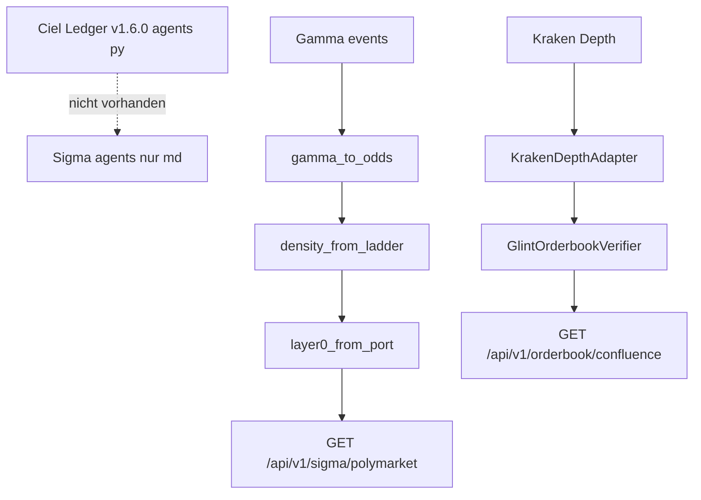

# Blueprint füttern — Glint JIT + Polymarket Gamma

**Status:** Implementiert (Branch jules/glint-polymarket-wiring)  
**Overview:** Ciel-Sandbox/Ledger ≠ Sigma-Repo. Umsetzung = Gamma/Kraken-Feldmapping in bestehende Engines (Port, Verifier, Panel). Kein Phantom-Deploy, kein Telethon, Gate 0.60 nur Anzeige.

## Todos

- [x] Gamma-Parser (`groupItemTitle` / `outcomePrices` / `volume24hr`) → `PolymarketOdds`; Fixture; TTL; keine Fake-Trajektorie
- [x] `RUNTIME_MAP` + Port in `scheduler_matrix`; Tests Feed-aus
- [x] Layer-0 Snapshot → `GET /api/v1/sigma/polymarket` + `/api/quant/polymarket/layer0`; `gate_open=False`
- [x] Bestehenden `GlintOrderbookVerifier` + `KrakenDepthAdapter` füttern; kein `agents/kraken_l2_verifier.py`
- [x] Offline-Fixtures in `tests/`; MP-17 fail-closed; keine Ciel-`agents/`-Tests als Source of Truth

## Alignment (Ciel-Stand)

Ciel hat die Diskrepanz anerkannt: Sandbox-Ledger ≠ lokales Repo; `agents/*.py` waren flüchtig; `glint_polymarket_schema.json` (DEX/Whale) ist obsolet. Nur Feldmapping in bestehende Engines.

## Ledger-Befund

Ciel Ledger v1.6.0 listete unter `agents/`: `kraken_l2_verifier.py`, `polymarket_gamma_feeder.py`, `test_sigma_live_adapters.py`. Im Repo liegen dort nur die vier Prompt-`.md` — die drei `.py`-Dateien existieren nicht.

Älteres Schema `GlintPolymarketAnalyticsSchema` (`dexVolume24h`, `smartMoneyFlowBias`, Whale-Cluster, flache `probabilityPct`) = anderes Produktkonzept (glint.trade On-Chain), nicht §24 Kraken-JIT und nicht MP-06 Strike-Leiter.

Zwei Glint-Begriffe nicht vermischen:

1. **§24 Glint × Orderbuch** (Sigma-Code): Kraken L2, `I_depth`, Veto — verdrahten.
2. **glint.trade Analytics-Schema**: DEX/Whale — nicht im Scope.

## Feldmapping (übernehmen)

**Gamma** — `GET https://gamma-api.polymarket.com/events?slug={slug}` (nicht `/events/{slug}`, nicht `btc-macro`):

- `slug`, `title`, `volume24hr`/`volume`, `liquidity`
- `markets[*].groupItemTitle` → Strike; `outcomePrices[0]` → Yes; Markt-Volumen optional

**Kraken Depth** — `GET https://api.kraken.com/0/public/Depth`:

- `result.{pair}.bids|asks` als `[price, volume, …]`
- 2 %-Band, Spread bps, Snapshot-Age &lt; 3 s → bestehende Verdicts

**Guardrails:** Gate 0.60 nur Anzeige; Paper-only; Offline-Fixtures; kein Telethon-Score.

## Nicht kopieren

| Ciel | Ablehnung |
|------|-----------|
| `agents/kraken_l2_verifier.py` | Duplikat von `app/quant/glint_orderbook_verifier.py` |
| `agents/polymarket_gamma_feeder.py` | Falsche μ-Formel + erfundene Trajektorie; Mapper → `sigma/ports/polymarket_port.py` + bestehende Density/Trajectory |
| `agents/test_sigma_live_adapters.py` | Tests nach `tests/`, Assertions gegen echte APIs |
| `glint_polymarket_schema.json` On-Chain | Anderer Blueprint; kein Feed |
| Ledger v1.6.0 als DONE | Index-Lüge |

Mathe:

- Yes = kumulativ → `density_from_ladder`, nicht `Σ(strike·pYes)/Σ(pYes)`
- Keine Spot-Interpolation als Trajektorie
- Blueprint-Verdict-Enums; Depth = Volumen im Band
- Stale = Snapshot-Age vs ExchangeClock

## Implementierung

1. Gamma-Mapper → `PolymarketOdds` / `validate_odds_payload`; TTL; Settings `POLYMARKET_*` in `SettingsEnvManager`; Port in `scheduler_matrix` wenn Feed an.
2. Snapshot-API → Panel und `/api/quant/polymarket/layer0`; `gate_open=False`.
3. Glint → bestehende JIT-Pfade + Panel; kein neues Modul unter `agents/`.
4. Tests → Offline-Fixtures in `tests/`; MP-17 fail-closed wenn Feed aus.

## Nicht im Scope

- Ciel-Ledger patchen / `agents/*.py` als Produktionscode
- glint.trade On-Chain / Telethon / Fake-8/10
- Polymarket-CLOB, Live-Orders, Gate als Trade-Blocker
- VectorBT / onnxruntime
